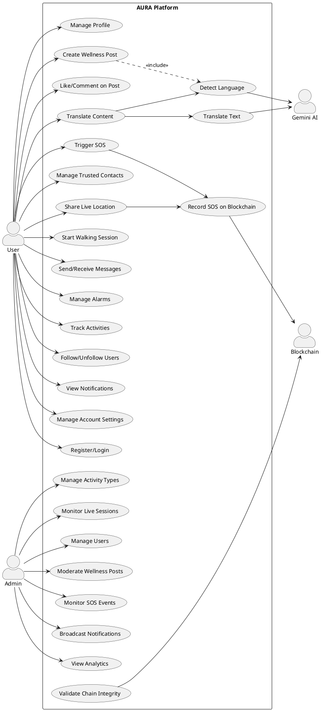
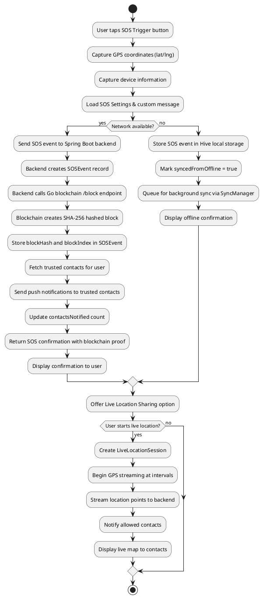
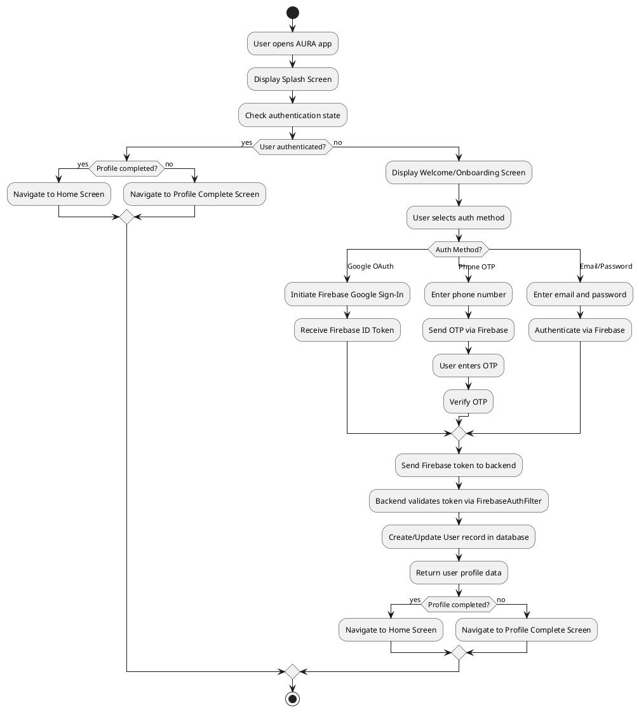
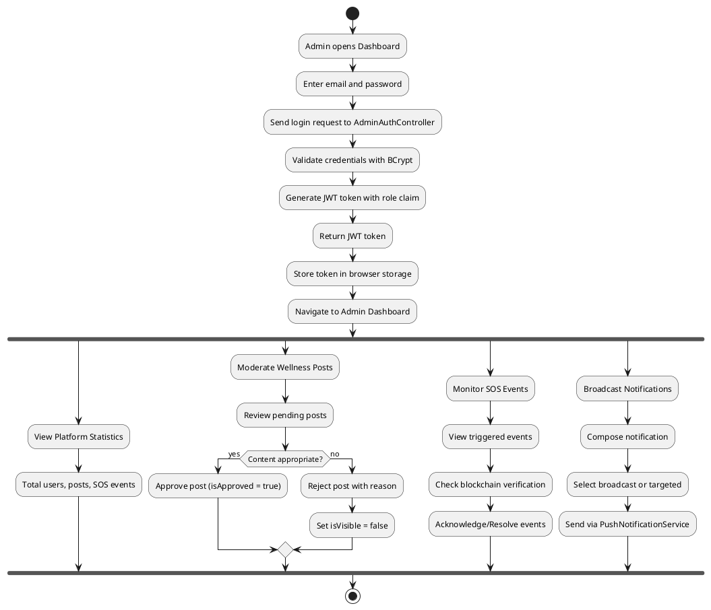
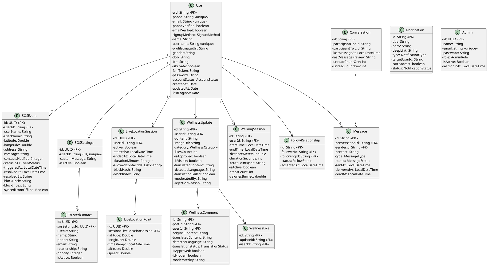

# AURA – AI Powered Wellness, Safety & Social Assistance Platform with Blockchain Integrity

## MCA Main Project Report

---

# CHAPTER 1: INTRODUCTION

## 1.1 Overview

In the contemporary digital landscape, individuals face fragmented solutions for wellness management, emergency response, and social connectivity. A person seeking to maintain daily health habits must use one application, rely on a separate system for emergency alerts, and resort to yet another platform for social interaction. This fragmentation creates cognitive overload, inconsistent data trails, and — most critically — delayed response times during life-threatening emergencies. AURA addresses this systemic gap by delivering a unified, intelligent platform that seamlessly integrates AI-powered wellness support, blockchain-backed emergency integrity, real-time safety tracking, and secure social networking into a single ecosystem.

AURA is a production-grade, full-stack mobile platform engineered using Flutter for the cross-platform mobile application, Spring Boot for the enterprise backend, a custom Go-based blockchain for immutable emergency record storage, and a Next.js administrative dashboard for centralized monitoring and governance. The system leverages Google's Gemini AI APIs for intelligent multilingual translation and content analytics, Google Maps APIs for real-time geospatial tracking, Firebase for authentication and push notifications, and WebSocket (STOMP) protocol for real-time bidirectional messaging.

## 1.2 Problem Statement

The existing digital wellness and safety landscape presents several critical deficiencies:

**Wellness Fragmentation:** Current wellness platforms operate in isolation — fitness trackers, mental health apps, and social support communities exist as disconnected silos. Users cannot holistically manage their physical activities, walking sessions, daily wellness updates, and social well-being through a single interface. There is no intelligent system that tracks activity types, logs daily activities, and provides categorized wellness feeds with community engagement.

**Emergency Response Delays:** Traditional emergency systems rely on manual phone calls or SMS, which are inadequate during situations where the victim cannot speak or type. There is no mechanism for one-tap SOS triggering with automatic GPS location capture, automatic notification of pre-configured trusted contacts, or real-time live location sharing that allows family members to track a person in distress.

**Lack of Secure & Tamper-Proof Reporting:** Emergency event records stored in conventional databases can be altered, deleted, or manipulated. In legal, insurance, or forensic scenarios, the integrity of emergency records — including timestamps, GPS coordinates, and user identity — must be cryptographically verifiable. No existing mobile safety platform provides blockchain-backed immutable storage of SOS events.

**Absence of AI-Driven Multilingual Assistance:** In a multilingual society, wellness communities suffer from language barriers. A user posting a wellness update in Tamil or Hindi cannot be understood by an English-speaking community member. There is no intelligent on-demand translation pipeline that detects the source language and provides AI-driven translation, enabling a truly inclusive wellness community.

**No Real-Time Family Safety Ecosystem:** Families lack a unified platform where members can share live locations during emergencies, communicate through secure real-time messaging, manage follow relationships for privacy, and receive push notifications for critical events — all within a single application governed by proper permission management.

## 1.3 Objectives

The primary objectives of the AURA platform are:

1. To design and develop a cross-platform mobile application using Flutter with Riverpod state management and Hive local storage that provides unified access to wellness, safety, messaging, and activity tracking features.
2. To implement a secure, scalable Spring Boot backend with Firebase authentication, JWT-based admin authorization, JPA/Hibernate ORM, and modular RESTful API architecture.
3. To build a custom blockchain module in Go (aura_chain) that cryptographically hashes and immutably stores SOS emergency events using SHA-256, ensuring forensic-grade integrity.
4. To integrate Google Gemini AI APIs for real-time language detection and on-demand translation of wellness posts and comments, enabling multilingual community interaction.
5. To develop a comprehensive Next.js administrative dashboard for user management, wellness content moderation, SOS event monitoring, notification broadcasting, and platform analytics.
6. To implement real-time communication via WebSocket (STOMP) for instant messaging and live location sharing during emergencies.

## 1.4 Scope of the Project

AURA encompasses the following functional domains:

- **User Authentication:** Multi-method authentication via Firebase (Google OAuth, Phone OTP, Email/Password) with secure token-based session management.
- **Wellness Social Feed:** Community-driven wellness posts with categories, likes, comments, AI translation, and admin moderation.
- **Activity Management:** Activity types, categories, user activities with scheduling (daily/weekly/custom), activity logging with status tracking, and daily activity summaries.
- **Walking Health Tracker:** GPS-tracked walking sessions with route recording, distance calculation, step counting, calorie estimation, and duration tracking.
- **SOS Emergency System:** One-tap SOS trigger with GPS capture, trusted contact notification, custom emergency messages, blockchain integrity storage, and live location sharing.
- **Real-Time Messaging:** WebSocket-based private messaging with conversation management, message status tracking (sent/delivered/read), and follow-based access control.
- **Alarm Module:** Local alarm system with customizable scheduling, native alarm service integration, and alarm ring screens.
- **Notification System:** Firebase Cloud Messaging (FCM) integration for targeted and broadcast push notifications with deep linking.
- **Admin Dashboard:** Next.js-based web application for comprehensive platform governance including user management, content moderation, SOS monitoring, and analytics.
- **Blockchain Integrity Layer:** Custom Go blockchain with file-based persistent storage for immutable SOS event recording and chain validation.

## 1.5 Methodology

AURA follows an Agile development methodology with iterative sprints. The project employs a microservice-oriented architecture where the Flutter mobile client, Spring Boot backend, Go blockchain service, and Next.js admin dashboard operate as independent yet interconnected modules. Each module follows clean architecture principles with clear separation of concerns — data layer, domain/business logic layer, and presentation layer.

---

# CHAPTER 2: PROPOSED SYSTEM

## 2.1 System Overview

AURA is proposed as a comprehensive, AI-powered platform that consolidates wellness management, emergency safety, social connectivity, and intelligent assistance into a unified ecosystem. Unlike existing fragmented solutions, AURA provides a single mobile application backed by a robust enterprise backend, a dedicated blockchain integrity layer, and a powerful administrative dashboard.

## 2.2 System Architecture

The AURA platform follows a multi-tier distributed architecture:

```
┌─────────────────────────────────────────────────────────────────┐
│                    PRESENTATION LAYER                           │
│  ┌──────────────────┐          ┌──────────────────────────┐     │
│  │   Flutter App    │          │  Next.js Admin Dashboard │     │
│  │  (Riverpod/Hive) │          │     (React/TypeScript)   │     │
│  └────────┬─────────┘          └────────────┬─────────────┘     │
└───────────┼─────────────────────────────────┼───────────────────┘
            │ REST API / WebSocket            │ REST API / JWT
┌───────────┼─────────────────────────────────┼───────────────────┐
│           ▼         APPLICATION LAYER       ▼                   │
│  ┌─────────────────────────────────────────────────────────┐    │
│  │              Spring Boot Backend                        │    │
│  │  ┌──────┐ ┌────────┐ ┌──────┐ ┌─────────┐ ┌─────────┐ │    │
│  │  │ Auth │ │Wellness│ │ SOS  │ │Messaging│ │Activity │ │    │
│  │  └──────┘ └────────┘ └──┬───┘ └─────────┘ └─────────┘ │    │
│  └──────────────────────────┼──────────────────────────────┘    │
└─────────────────────────────┼───────────────────────────────────┘
                              │ HTTP API
┌─────────────────────────────┼───────────────────────────────────┐
│                  BLOCKCHAIN LAYER                               │
│              ┌──────────────▼──────────────┐                    │
│              │   Go Blockchain (aura_chain) │                    │
│              │   SHA-256 / File Storage     │                    │
│              └─────────────────────────────┘                    │
└─────────────────────────────────────────────────────────────────┘
┌─────────────────────────────────────────────────────────────────┐
│                    DATA & SERVICES LAYER                        │
│  ┌──────────┐  ┌──────────┐  ┌──────────┐  ┌───────────────┐   │
│  │PostgreSQL│  │ Firebase │  │Google    │  │  Gemini AI    │   │
│  │ Database │  │Auth/FCM  │  │Maps API  │  │  Translation  │   │
│  └──────────┘  └──────────┘  └──────────┘  └───────────────┘   │
└─────────────────────────────────────────────────────────────────┘
```

## 2.3 Key Design Principles

1. **Modularity:** Each feature (auth, wellness, SOS, messaging, activity, notifications) is implemented as an independent module with its own controller, service, repository, model, and DTO layers.
2. **Security-First:** Firebase authentication for mobile users, JWT tokens for admin access, Spring Security filter chains, and CORS configuration ensure defense-in-depth.
3. **Offline Resilience:** Hive local storage on the Flutter client enables offline data caching with SyncManager for background synchronization.
4. **Immutable Audit Trail:** The Go blockchain provides cryptographic proof of SOS events that cannot be retroactively altered.
5. **Real-Time Communication:** STOMP-based WebSocket messaging enables instant chat delivery and live location streaming.
6. **AI Intelligence:** Gemini AI integration provides automated language detection, content translation, and analytics capabilities.

## 2.4 Advantages of Proposed System

| Feature | Existing Systems | AURA |
|---------|-----------------|------|
| Wellness + Safety | Separate apps | Unified platform |
| Emergency Records | Mutable database | Blockchain-immutable |
| Language Support | Single language | AI-powered multilingual |
| Location Sharing | Manual sharing | Real-time live tracking |
| Community Feed | Basic posts | Moderated, categorized, translatable |
| Admin Control | Limited | Full dashboard with analytics |
| Messaging | Third-party apps | Built-in WebSocket chat |
| Activity Tracking | Generic trackers | Custom activity scheduling + logging |

---

# CHAPTER 3: FEATURES OF THE PROPOSED SYSTEM

## 3.1 AI-Powered Translation

AURA integrates Google Gemini AI APIs to provide intelligent multilingual support:

- **Automatic Language Detection:** When a user creates a wellness post or comment, the system automatically detects the source language (stored as `detectedLanguage` field).
- **On-Demand Translation:** Content is translated to English (or the user's preferred language) and stored in the `translatedContent` field. Translation status is tracked via `TranslationStatus` enum (PENDING, TRANSLATED, FAILED, NOT_NEEDED).
- **Comment Translation:** Comments on wellness posts are independently translated, enabling cross-language conversations within the community.

## 3.2 Walking Health Tracker

The walking module provides comprehensive GPS-based health tracking:

- **Route Recording:** GPS coordinates are captured at regular intervals and stored as `routePointsJson` (serialized route data).
- **Health Metrics:** Distance (meters), duration (seconds), step count, and calories burned are computed in real-time.
- **Session Management:** Active sessions are tracked with `isActive` flag, supporting start/pause/stop workflows.
- **Google Maps Integration:** Route visualization on interactive maps with polyline rendering.

## 3.3 SOS Emergency System with Blockchain

The SOS module is the safety cornerstone of AURA:

- **One-Tap Trigger:** Users trigger SOS with a single tap, automatically capturing GPS coordinates (latitude/longitude), device info, and timestamp.
- **Trusted Contact Notification:** Pre-configured trusted contacts (with name, phone, email, relationship, priority) are automatically notified via SMS and push notification.
- **Custom Emergency Message:** Users can configure personalized emergency messages (default: "I need help! This is an emergency.").
- **Blockchain Integrity:** Each SOS event is simultaneously recorded on the Go blockchain, generating a cryptographic `blockHash` and `blockIndex` that are stored alongside the event.
- **Event Lifecycle:** Events follow a status workflow: TRIGGERED → ACKNOWLEDGED → RESOLVED, with resolution notes and resolver tracking.
- **Offline Sync:** SOS events triggered offline are queued and synced when connectivity is restored (`syncedFromOffline` flag).

## 3.4 Live Location Sharing

- **Real-Time Sessions:** Users can start live location sessions with configurable duration.
- **Granular Tracking:** Location points (latitude, longitude, altitude, speed, timestamp) are streamed in real-time.
- **Access Control:** Sessions specify `allowedContactIds` to restrict who can view the live location.
- **Blockchain Binding:** Live location sessions can also be blockchain-anchored for integrity.

## 3.5 Real-Time Messaging

- **WebSocket Architecture:** STOMP protocol over WebSocket with `/ws` endpoint, topic-based (`/topic`, `/queue`) message routing, and user-destination prefix (`/user`).
- **Conversation Management:** Two-participant conversations with unread count tracking per participant.
- **Message Features:** Text and image message types, delivery status tracking (SENT → DELIVERED → READ), and timestamp management.
- **Follow-Based Access:** Messaging is gated by follow relationships with PENDING/ACCEPTED/REJECTED status workflow.

## 3.6 Notifications System

- **Push Notifications:** Firebase Cloud Messaging (FCM) with device token management (`fcmToken` on User model).
- **Notification Types:** SYSTEM, SOS_ALERT, ANNOUNCEMENT, REMINDER, WELLNESS categories.
- **Broadcast Support:** Admin can send broadcast notifications to all users or targeted notifications to specific users.
- **Deep Linking:** Notifications include `deepLink` field for directing users to specific screens.
- **Status Tracking:** PENDING → SENT → FAILED lifecycle management.

## 3.7 Admin Dashboard

The Next.js administrative dashboard provides:

- **User Management:** View, search, and manage all registered users.
- **Wellness Moderation:** Approve, reject, or hide wellness posts and comments with rejection reasons.
- **SOS Event Monitoring:** Real-time view of all SOS events with detailed modal views including blockchain verification data.
- **Activity Management:** Manage activity types, categories, and gym exercises.
- **Notification Broadcasting:** Send system-wide or targeted notifications.
- **Analytics Dashboard:** Platform statistics including user counts, event metrics, and wellness engagement data.
- **Live Session Monitoring:** View active live location sessions.

## 3.8 Alarm Module

- **Local Alarm System:** Create, edit, and manage alarms with customizable time settings.
- **Native Integration:** Platform-native alarm service via `AlarmNativeService` for reliable alarm triggering.
- **Alarm Ring Screen:** Dedicated full-screen alarm ring interface with dismiss/snooze options.
- **Hive Persistence:** Alarm data persisted locally using Hive with generated adapters.

## 3.9 Activity Management System

- **Activity Types & Categories:** Hierarchical organization — categories contain types (e.g., "Fitness" → "Running", "Yoga").
- **User Activities:** Users subscribe to activities with custom scheduling (daily, weekly, custom repeat types).
- **Activity Logging:** Each activity instance is logged with status (PENDING/COMPLETED/SKIPPED), actual duration, distance, calories, and notes.
- **Daily Activity Summary:** Aggregated daily view via `DailyActivity` model linking user and date.

## 3.10 Permissions System

- **Granular Permissions:** Dedicated permissions screen managing location, notification, camera, and storage permissions.
- **Progressive Disclosure:** Permissions are requested contextually when features require them.

## 3.11 Social Features

- **Follow System:** Users follow/unfollow with privacy-aware request workflow (PENDING → ACCEPTED/REJECTED for private accounts).
- **User Profiles:** Complete profiles with name, username, bio, profile image, gender, date of birth, and privacy settings (`isPrivate`).
- **Follower/Following Lists:** Dedicated screens for viewing follower and following lists.

---

# CHAPTER 4: REQUIREMENTS SPECIFICATION

## 4.1 Functional Requirements

### 4.1.1 User Functional Requirements

| ID | Requirement | Description |
|----|------------|-------------|
| FR-U01 | Multi-Method Registration | Users can register via Google OAuth, Phone OTP, or Email/Password |
| FR-U02 | Profile Management | Users can complete and edit profiles with name, username, bio, image, gender, DOB |
| FR-U03 | Wellness Post Creation | Users can create wellness posts with content, images, and categories |
| FR-U04 | Post Interaction | Users can like, comment on, and translate wellness posts |
| FR-U05 | SOS Trigger | Users can trigger one-tap emergency SOS with automatic GPS capture |
| FR-U06 | Trusted Contact Management | Users can add/edit/remove trusted contacts with priority levels |
| FR-U07 | Live Location Sharing | Users can share real-time location with selected contacts |
| FR-U08 | Walking Session | Users can start/stop GPS-tracked walking sessions |
| FR-U09 | Private Messaging | Users can send real-time messages to followed users |
| FR-U10 | Alarm Management | Users can create, edit, delete, and manage alarms |
| FR-U11 | Activity Tracking | Users can subscribe to activities and log completion |
| FR-U12 | Follow Management | Users can follow/unfollow others with request-based privacy |
| FR-U13 | Notification Management | Users can view and manage push notifications |
| FR-U14 | Account Settings | Users can change password, phone number, and notification preferences |

### 4.1.2 Admin Functional Requirements

| ID | Requirement | Description |
|----|------------|-------------|
| FR-A01 | Admin Authentication | Secure JWT-based login with role-based access control |
| FR-A02 | User Management | View, search, and manage all registered user accounts |
| FR-A03 | Wellness Moderation | Approve, reject, or hide wellness posts with reasons |
| FR-A04 | SOS Monitoring | Monitor all SOS events with status tracking and blockchain verification |
| FR-A05 | Notification Broadcasting | Send targeted or broadcast push notifications |
| FR-A06 | Activity Configuration | Manage activity types, categories, and exercises |
| FR-A07 | Analytics Dashboard | View platform-wide statistics and engagement metrics |
| FR-A08 | Live Session Monitoring | Monitor active live location sharing sessions |

### 4.1.3 Real-Time Functional Requirements

| ID | Requirement | Description |
|----|------------|-------------|
| FR-R01 | WebSocket Messaging | Real-time message delivery via STOMP WebSocket |
| FR-R02 | Live Location Streaming | Real-time GPS coordinate streaming during sessions |
| FR-R03 | Push Notification Delivery | Instant FCM push notification delivery |
| FR-R04 | Message Status Updates | Real-time SENT → DELIVERED → READ status tracking |

### 4.1.4 AI Service Requirements

| ID | Requirement | Description |
|----|------------|-------------|
| FR-AI01 | Language Detection | Automatic detection of content language via Gemini AI |
| FR-AI02 | Content Translation | On-demand translation of posts and comments |
| FR-AI03 | Translation Status Tracking | Track translation status (PENDING/TRANSLATED/FAILED/NOT_NEEDED) |

### 4.1.5 Blockchain Service Requirements

| ID | Requirement | Description |
|----|------------|-------------|
| FR-B01 | SOS Block Creation | Create blockchain blocks for each SOS event |
| FR-B02 | Chain Validation | Validate entire blockchain integrity on demand |
| FR-B03 | Block Retrieval | Retrieve specific blocks by index for verification |
| FR-B04 | Immutable Storage | Persist blocks as individual JSON files for durability |

## 4.2 Non-Functional Requirements

### 4.2.1 Performance

- API response time shall not exceed 500ms for standard CRUD operations.
- WebSocket message delivery latency shall be under 200ms on stable connections.
- SOS trigger-to-notification time shall not exceed 3 seconds.
- Walking session GPS capture interval shall be configurable (default: 5 seconds).
- Blockchain block creation shall complete within 1 second.

### 4.2.2 Scalability

- The Spring Boot backend shall support horizontal scaling via stateless REST API design.
- Database queries shall be optimized with JPA repository methods and indexed columns.
- WebSocket connections shall support concurrent user sessions via Spring's STOMP broker.
- The admin dashboard shall handle up to 10,000 users in management views with pagination.

### 4.2.3 Security

- All API endpoints shall be secured via Firebase Authentication token verification.
- Admin endpoints shall require JWT tokens with HMAC-SHA256 signature verification.
- CORS shall be configured to restrict cross-origin access.
- User passwords shall be encrypted using BCrypt hashing (via `PasswordConfig`).
- CSRF protection shall be appropriately configured for API-only backends.
- Sensitive data (JWT secrets, Firebase credentials) shall be managed via environment variables.

### 4.2.4 Reliability

- Offline SOS events shall be queued locally (Hive) and synced upon connectivity restoration.
- Blockchain data shall be persisted as individual JSON files ensuring crash recovery.
- The `SyncManager` shall handle background data synchronization with retry logic.
- Database entities shall use `@PrePersist` and `@PreUpdate` lifecycle hooks for data consistency.

### 4.2.5 Usability

- The Flutter app shall support both light and dark themes with smooth transitions.
- Navigation shall use custom animated page transitions (slide + fade, 300ms duration).
- The admin dashboard shall provide a responsive layout with sidebar navigation.
- Error states shall display meaningful messages with retry options.

### 4.2.6 Maintainability

- All modules shall follow clean architecture with data/domain/presentation layer separation.
- Backend modules shall follow Controller → Service → Repository → Model pattern.
- Comprehensive logging shall be implemented via `AuraLogger` and `RequestLoggingFilter`.
- Code shall use annotation-based configuration (Spring) and provider-based state management (Riverpod).

---

# CHAPTER 5: UML DIAGRAMS

## 5.1 Use Case Diagram



## 5.2 Activity Diagram — SOS Emergency Flow



## 5.3 Activity Diagram — User Registration & Authentication



## 5.4 Activity Diagram — Admin Workflow



## 5.5 Class Diagram (Major Entities)



---

# CHAPTER 6: TEST CASES

## 6.1 User Authentication Test Cases

| Test Case ID | Test Scenario | Pre-Condition | Test Steps | Expected Result | Status |
|-------------|--------------|---------------|------------|-----------------|--------|
| TC-AUTH-01 | Google OAuth Login | App installed, Google account available | 1. Open app 2. Tap "Continue with Google" 3. Select Google account | User authenticated, redirected to Home/Profile Complete screen | Pass |
| TC-AUTH-02 | Phone OTP Login | Valid phone number | 1. Tap "Login with Phone" 2. Enter phone number 3. Wait for OTP 4. Enter OTP | OTP verified, user created/loggedin, token stored | Pass |
| TC-AUTH-03 | Email/Password Login | Registered email account | 1. Tap "Login with Email" 2. Enter email and password 3. Tap Login | Credentials validated via Firebase, session created | Pass |
| TC-AUTH-04 | Invalid OTP Entry | OTP sent to phone | 1. Enter wrong OTP 2. Submit | Error message displayed, login blocked | Pass |
| TC-AUTH-05 | Session Persistence | User previously logged in | 1. Kill app 2. Reopen app | User auto-logged in via stored Firebase token | Pass |

## 6.2 Registration Test Cases

| Test Case ID | Test Scenario | Pre-Condition | Test Steps | Expected Result | Status |
|-------------|--------------|---------------|------------|-----------------|--------|
| TC-REG-01 | New User Registration | No existing account | 1. Open app 2. Choose auth method 3. Complete auth flow | New User record created in database with signupMethod set | Pass |
| TC-REG-02 | Profile Completion | User authenticated, profile incomplete | 1. Enter name, username, gender, DOB 2. Upload profile image 3. Submit | profileCompleted = true, redirected to Home screen | Pass |
| TC-REG-03 | Duplicate Username | Username already taken | 1. Enter existing username 2. Submit | Error: "Username already taken" displayed | Pass |
| TC-REG-04 | Missing Required Fields | Profile completion screen open | 1. Leave name empty 2. Tap Submit | Validation error shown, submission blocked | Pass |

## 6.3 Wellness Post Test Cases

| Test Case ID | Test Scenario | Pre-Condition | Test Steps | Expected Result | Status |
|-------------|--------------|---------------|------------|-----------------|--------|
| TC-WEL-01 | Create Wellness Post | User logged in | 1. Navigate to Wellness Feed 2. Tap Create 3. Enter content, select category 4. Submit | Post created, appears in feed after admin approval | Pass |
| TC-WEL-02 | Like a Post | Post visible in feed | 1. Tap like button on post | likesCount incremented, WellnessLike record created | Pass |
| TC-WEL-03 | Comment on Post | Post visible in feed | 1. Open post 2. Enter comment 3. Submit | Comment created, AI translation triggered | Pass |
| TC-WEL-04 | Post with Image | User on create screen | 1. Enter content 2. Attach image 3. Submit | Image uploaded, imageUrl stored, post created | Pass |

## 6.4 AI Translation Test Cases

| Test Case ID | Test Scenario | Pre-Condition | Test Steps | Expected Result | Status |
|-------------|--------------|---------------|------------|-----------------|--------|
| TC-AI-01 | Auto Language Detection | Post created in Hindi | 1. Create post in Hindi 2. Submit | detectedLanguage = "hi", translation initiated | Pass |
| TC-AI-02 | Translation to English | Non-English post submitted | 1. Post created 2. Backend calls Gemini API | translatedContent populated, translationStatus = TRANSLATED | Pass |
| TC-AI-03 | English Post (No Translation) | Post in English | 1. Create post in English | translationStatus = NOT_NEEDED, translatedContent = null | Pass |
| TC-AI-04 | Translation Failure Handling | Gemini API unavailable | 1. Post created 2. API fails | translationFailed = true, original content displayed | Pass |

## 6.5 SOS Emergency Test Cases

| Test Case ID | Test Scenario | Pre-Condition | Test Steps | Expected Result | Status |
|-------------|--------------|---------------|------------|-----------------|--------|
| TC-SOS-01 | SOS Trigger (Online) | Location permission granted, trusted contacts configured | 1. Navigate to SOS 2. Tap trigger button | SOSEvent created, GPS captured, blockchain block created, contacts notified | Pass |
| TC-SOS-02 | SOS Trigger (Offline) | No network connectivity | 1. Tap SOS trigger 2. Confirm | Event stored in Hive, syncedFromOffline = true, queued for sync | Pass |
| TC-SOS-03 | Blockchain Verification | SOS event exists | 1. View SOS event details 2. Check blockchain hash | blockHash matches blockchain record, chain validates as valid | Pass |
| TC-SOS-04 | SOS Resolution | Admin logged in, SOS event active | 1. Open SOS event 2. Add resolution notes 3. Mark resolved | status = RESOLVED, resolvedAt and resolvedBy set | Pass |

## 6.6 Live Location Test Cases

| Test Case ID | Test Scenario | Pre-Condition | Test Steps | Expected Result | Status |
|-------------|--------------|---------------|------------|-----------------|--------|
| TC-LOC-01 | Start Live Location | Location permission granted | 1. Navigate to Live Location 2. Set duration 3. Start | LiveLocationSession created, GPS streaming begins | Pass |
| TC-LOC-02 | Location Point Streaming | Session active | 1. Move to different location | New LiveLocationPoint records created with lat/lng/speed/altitude | Pass |
| TC-LOC-03 | Session Expiry | Duration elapsed | 1. Wait for session duration | Session marked active = false, endedAt set | Pass |

## 6.7 Messaging Test Cases

| Test Case ID | Test Scenario | Pre-Condition | Test Steps | Expected Result | Status |
|-------------|--------------|---------------|------------|-----------------|--------|
| TC-MSG-01 | Send Text Message | Users mutually follow each other | 1. Open chat 2. Type message 3. Send | Message delivered via WebSocket, status = SENT | Pass |
| TC-MSG-02 | Message Read Receipt | Message delivered to recipient | 1. Recipient opens conversation | Message status → DELIVERED → READ, readAt timestamp set | Pass |
| TC-MSG-03 | New Conversation Creation | No existing conversation | 1. Navigate to user profile 2. Tap Message | New Conversation record created, chat screen opens | Pass |

## 6.8 Alarm Test Cases

| Test Case ID | Test Scenario | Pre-Condition | Test Steps | Expected Result | Status |
|-------------|--------------|---------------|------------|-----------------|--------|
| TC-ALM-01 | Create Alarm | User on alarm list | 1. Tap Create 2. Set time 3. Save | Alarm saved in Hive, native alarm scheduled | Pass |
| TC-ALM-02 | Alarm Trigger | Alarm time reached | 1. Wait for scheduled time | Alarm ring screen displayed with dismiss/snooze options | Pass |
| TC-ALM-03 | Edit Alarm | Existing alarm | 1. Tap alarm 2. Modify time 3. Save | Alarm updated, native alarm rescheduled | Pass |
| TC-ALM-04 | Delete Alarm | Existing alarm | 1. Delete alarm | Alarm removed from Hive, native alarm cancelled | Pass |

## 6.9 Admin Moderation Test Cases

| Test Case ID | Test Scenario | Pre-Condition | Test Steps | Expected Result | Status |
|-------------|--------------|---------------|------------|-----------------|--------|
| TC-ADM-01 | Approve Wellness Post | Pending post exists | 1. Login to admin dashboard 2. Navigate to Wellness 3. Approve post | isApproved = true, post visible to users | Pass |
| TC-ADM-02 | Reject Wellness Post | Pending post exists | 1. Navigate to Wellness 2. Reject with reason | isVisible = false, rejectionReason stored | Pass |
| TC-ADM-03 | Broadcast Notification | Admin logged in | 1. Navigate to Notifications 2. Compose message 3. Send broadcast | Notification sent to all users via FCM, isBroadcast = true | Pass |
| TC-ADM-04 | View SOS Analytics | Admin logged in | 1. Navigate to SOS Events 2. View details | Full event list with status, blockchain hash, maps URL displayed | Pass |

---

# CHAPTER 7: INPUT AND OUTPUT DESIGN

## 7.1 Flutter Mobile Application — Input Design

### 7.1.1 Authentication Inputs
- **Phone Login Screen:** Phone number text field with country code selector, OTP input (6-digit PIN fields).
- **Email Login Screen:** Email text field with validation, password field with visibility toggle (via `PasswordTextField` widget).
- **Google Auth:** Single button tap initiating Firebase Google OAuth flow.

### 7.1.2 Profile Inputs
- **Profile Complete Screen:** Name, username (with real-time availability check), gender dropdown, date of birth picker, profile image upload (camera/gallery), bio text area (200 character limit).
- **Edit Profile Screen:** Same fields as profile complete, pre-populated with existing data.

### 7.1.3 Wellness Inputs
- **Create Wellness Update Screen:** Content text area (500 character limit), category selector (WellnessCategory enum values), optional image attachment.
- **Comment Input:** Text field for comments (1000 character limit) within post detail view.

### 7.1.4 SOS Inputs
- **SOS Trigger Screen:** Single emergency button (tap to trigger), automatic GPS capture (no manual input).
- **SOS Settings Screen:** Custom emergency message text area (500 characters), trusted contact form (name, phone, email, relationship, priority).

### 7.1.5 Walking Inputs
- **Walking Screen:** Start/Stop button, automatic GPS tracking (no manual coordinate entry).

### 7.1.6 Messaging Inputs
- **Chat Screen:** Message text field, send button, image attachment option.

### 7.1.7 Alarm Inputs
- **Create Alarm Screen:** Time picker widget (hour/minute), label text field, repeat options.

### 7.1.8 Settings Inputs
- **Change Password Screen:** Current password, new password, confirm password fields.
- **Change Phone Screen:** New phone number with OTP verification.
- **Notification Settings Screen:** Toggle switches for notification categories.

## 7.2 Admin Dashboard — Input Design

- **Login Form:** Email and password fields with validation.
- **Wellness Moderation:** Approve/Reject action buttons, rejection reason text area.
- **Notification Composer:** Title, body, notification type dropdown, target user selector (or broadcast toggle).
- **Activity Management:** Activity type/category name, description, icon fields.
- **Search Bars:** Universal search across users, posts, and SOS events.

## 7.3 System Outputs

### 7.3.1 Flutter App Outputs
- **Home Screen:** Tabbed navigation with wellness feed preview, quick action buttons (SOS, Walking, Messaging), daily activity tracker widget.
- **Wellness Feed:** Card-based scrollable feed with user avatar, post content (original + translated), like count, comment count, category badge, timestamp.
- **SOS Confirmation:** Success overlay with blockchain hash, event ID, contacts notified count, and Google Maps URL.
- **Walking Session Summary:** Distance (meters/km), duration (formatted), steps count, calories burned, route map with polyline visualization.
- **Chat List:** Conversation cards with participant name, last message preview, unread count badge, timestamp.
- **Notification Screen:** Chronological notification list with type icons, title, body, deep link actions.
- **Alarm Ring Screen:** Full-screen alarm display with dismiss and snooze buttons, current time, alarm label.

### 7.3.2 Admin Dashboard Outputs
- **Dashboard Page:** StatCard components displaying total users, active SOS events, pending wellness posts, notification counts.
- **User Management Table:** Paginated user list with name, email, phone, status, signup method, last login.
- **SOS Events Table:** Event list with user details, coordinates, status badge, blockchain verification, maps link, timestamps.
- **SOS Event Detail Modal:** Full event information including blockchain hash, block index, resolution history.
- **Wellness Posts Table:** Post list with content preview, category, approval status, translation status, moderation actions.
- **Analytics Charts:** Visual charts showing user growth, SOS event trends, wellness engagement metrics.

### 7.3.3 Real-Time Outputs
- **WebSocket Messages:** Instant message delivery in chat with typing indicators.
- **Push Notifications:** FCM notifications with title, body, and deep link for SOS alerts, follow requests, messages, and system announcements.
- **Live Location Map:** Real-time map with moving marker showing user's current position, speed, and timestamp.

### 7.3.4 Error Outputs
- **Network Errors:** Connectivity wrapper displaying offline banner with retry option.
- **Validation Errors:** Field-level error messages for form inputs.
- **API Errors:** Toast notifications with error descriptions.
- **Empty States:** Illustrated empty state components with descriptive messages (via `EmptyState` component).

---

# CHAPTER 8: SYSTEM IMPLEMENTATION

## 8.1 Project Structure

### 8.1.1 Flutter Mobile Application (`aura_app/`)

```
aura_app/
├── lib/
│   ├── main.dart                          # App entry point
│   ├── app.dart                           # MaterialApp configuration
│   ├── core/
│   │   ├── api/                           # API configuration
│   │   ├── config/                        # App configuration
│   │   ├── constants/                     # App-wide constants
│   │   ├── network/
│   │   │   ├── connectivity/              # Network connectivity wrapper
│   │   │   ├── push/                      # FCM push notification handler
│   │   │   └── sync/                      # Background sync manager
│   │   ├── providers/                     # Global Riverpod providers
│   │   ├── routes/
│   │   │   ├── app_router.dart            # Route generation (35+ routes)
│   │   │   └── app_routes.dart            # Route name constants
│   │   ├── services/                      # Local notification service
│   │   ├── state/                         # Global state management
│   │   ├── theme/
│   │   │   ├── app_theme.dart             # Light/Dark theme definitions
│   │   │   └── theme_provider.dart        # Theme state provider
│   │   ├── ui/                            # Common UI utilities
│   │   └── widgets/                       # 16 reusable widgets
│   └── features/
│       ├── auth/                          # Authentication (12 files)
│       │   ├── data/datasources/          # Remote & Firebase datasources
│       │   ├── domain/models/             # Auth success payload
│       │   └── presentation/
│       │       ├── providers/             # Login, OTP, Google auth providers
│       │       └── screens/              # Auth, Email, Phone, OTP screens
│       ├── user/                          # User management (19 files)
│       ├── wellness/                      # Wellness feed (18 files)
│       ├── sos/                           # SOS emergency (19 files)
│       │   ├── live/                      # Live location screen
│       │   └── presentation/             # SOS trigger, settings screens
│       ├── messaging/                     # Real-time chat (5 files)
│       ├── walking/                       # Walking tracker (8 files)
│       ├── alarm/                         # Alarm system (10 files)
│       ├── activity_types/                # Activity types (8 files)
│       ├── user_activities/               # User activities (12 files)
│       ├── daily_activity/                # Daily activity (7 files)
│       ├── notification/                  # Notifications (3 files)
│       ├── home/                          # Home screen (14 files)
│       ├── onboarding/                    # Welcome screen
│       ├── splash/                        # Splash screen
│       ├── legal/                         # Privacy policy
│       └── common/                        # Shared components
```

### 8.1.2 Spring Boot Backend (`aura_backend/`)

```
aura_backend/src/main/java/com/backend/aura/
├── AuraApplication.java                   # Spring Boot entry point
├── config/
│   ├── RequestLoggingFilter.java          # HTTP request/response logging
│   ├── cors/CorsConfig.java              # CORS configuration
│   ├── firebase/FirebaseConfig.java       # Firebase Admin SDK setup
│   ├── security/
│   │   ├── SecurityConfig.java            # Security filter chain
│   │   ├── jwt/JwtUtil.java               # JWT generation/validation
│   │   └── password/PasswordConfig.java   # BCrypt password encoder
│   └── web/WebConfig.java                 # Web MVC configuration
├── core/
│   └── logging/AuraLogger.java            # Centralized logging utility
└── modules/
    ├── auth/                              # Authentication (12 files)
    │   ├── admin/                         # Admin auth (controller, service, DTOs)
    │   ├── dto/                           # Login request/response DTOs
    │   └── firebase/                      # Firebase auth filter, service, context
    ├── user/                              # User management (9 files)
    │   ├── controller/UserController.java
    │   ├── model/User.java                # User entity (20+ fields)
    │   ├── service/UserService.java
    │   └── repository/UserRepository.java
    ├── wellness/                          # Wellness module (18 files)
    │   ├── controller/                    # WellnessController, CommentController, AdminController
    │   ├── model/                         # WellnessUpdate, WellnessComment, WellnessLike
    │   └── service/                       # WellnessService, CommentService
    ├── sos/                               # SOS module (27 files)
    │   ├── controller/                    # SOSController, AdminController, LiveLocationController
    │   ├── model/                         # SOSEvent, SOSSettings, TrustedContact,
    │   │                                  # LiveLocationSession, LiveLocationPoint
    │   └── service/                       # SOSService, LiveLocationService
    ├── messaging/                         # Messaging module (9 files)
    │   ├── config/WebSocketConfig.java    # STOMP WebSocket configuration
    │   ├── model/                         # Conversation, Message, FollowRelationship
    │   └── service/MessagingService.java
    ├── notification/                      # Notification module (7 files)
    │   ├── model/Notification.java
    │   └── service/                       # NotificationService, PushNotificationService
    ├── activity/                          # Activity module (35 files)
    │   ├── category/                      # Activity categories (6 files)
    │   ├── type/                          # Activity types (6 files)
    │   ├── useractivity/                  # User activities (6 files)
    │   ├── log/                           # Activity logs (6 files)
    │   ├── daily/                         # Daily activities (3 files)
    │   └── walking/                       # Walking sessions (5 files)
    └── admin/                             # Admin module (7 files)
```

### 8.1.3 Go Blockchain Module (`aura_chain/`)

```
aura_chain/
├── cmd/
│   └── main.go                # Application entry point
├── config/
│   └── config.go              # Environment configuration (.env)
├── internal/
│   ├── block/
│   │   └── block.go           # Block struct with SHA-256 hashing
│   ├── blockchain/
│   │   └── chain.go           # Chain management with mutex locking
│   ├── server/
│   │   └── http.go            # REST API server (Gorilla Mux)
│   ├── storage/
│   │   └── file.go            # File-based block persistence
│   └── transaction/
│       └── tx.go              # SOS transaction structure
├── data/                      # Block JSON file storage
├── go.mod                     # Go module definition
└── .env                       # Configuration (port, storage path)
```

### 8.1.4 Next.js Admin Dashboard (`aura_admin/`)

```
aura_admin/
├── app/
│   ├── page.tsx                           # Landing/Login page
│   ├── layout.tsx                         # Root layout with ThemeProvider
│   ├── globals.css                        # Global styles
│   ├── admin/
│   │   ├── layout.tsx                     # Admin layout with Sidebar
│   │   ├── dashboard/page.tsx             # Analytics dashboard
│   │   ├── users/page.tsx                 # User management
│   │   ├── wellness/page.tsx              # Wellness post moderation
│   │   ├── sos-events/page.tsx            # SOS event monitoring
│   │   ├── notifications/page.tsx         # Notification broadcasting
│   │   ├── activities/page.tsx            # Activity management
│   │   ├── categories/page.tsx            # Category management
│   │   ├── gym-exercises/page.tsx         # Exercise management
│   │   ├── live-sessions/page.tsx         # Live location monitoring
│   │   ├── settings/page.tsx              # Admin settings
│   │   └── login/page.tsx                 # Admin login
│   ├── components/
│   │   ├── layout/                        # AdminHeader, Sidebar
│   │   ├── sos/SOSEventDetailsModal.tsx   # SOS detail modal
│   │   ├── loaders/PageLoader.tsx         # Loading component
│   │   └── ui/                            # 12 reusable UI components
│   ├── core/
│   │   ├── config/app-config.ts           # API base URL config
│   │   ├── constants/colors.ts            # Color palette & gradients
│   │   ├── network/                       # API client & endpoints
│   │   ├── providers/ThemeProvider.tsx     # Dark/Light theme provider
│   │   └── utils/validators.ts            # Input validators
│   └── modules/
│       ├── auth/                          # Admin auth service & models
│       ├── sos/                           # SOS service & models
│       └── wellness/                      # Wellness service & models
```

## 8.2 Database Design

### 8.2.1 Users Table

| Column Name | Data Type | Constraints | Description |
|-------------|-----------|-------------|-------------|
| uid | VARCHAR(255) | PRIMARY KEY | Firebase UID |
| phone | VARCHAR(255) | UNIQUE | User phone number |
| email | VARCHAR(255) | UNIQUE | User email address |
| phone_verified | BOOLEAN | | Phone verification status |
| email_verified | BOOLEAN | | Email verification status |
| signup_method | VARCHAR(50) | ENUM | GOOGLE, PHONE, EMAIL |
| google_linked | BOOLEAN | | Google account linked |
| email_password_linked | BOOLEAN | | Email/password linked |
| phone_linked | BOOLEAN | | Phone linked |
| name | VARCHAR(255) | | Full name |
| username | VARCHAR(255) | UNIQUE | Unique username |
| profile_image_url | VARCHAR(255) | | Profile image URL |
| gender | VARCHAR(50) | | User gender |
| dob | VARCHAR(50) | | Date of birth |
| profile_completed | BOOLEAN | | Profile completion flag |
| bio | VARCHAR(200) | | User biography |
| is_private | BOOLEAN | | Private account flag |
| fcm_token | VARCHAR(512) | | Firebase Cloud Messaging token |
| password | VARCHAR(255) | | Encrypted password (BCrypt) |
| account_status | VARCHAR(50) | ENUM | ACTIVE, SUSPENDED, DELETED |
| created_at | TIMESTAMP | | Account creation time |
| updated_at | TIMESTAMP | | Last update time |
| last_login_at | TIMESTAMP | | Last login time |

### 8.2.2 SOS Events Table

| Column Name | Data Type | Constraints | Description |
|-------------|-----------|-------------|-------------|
| id | UUID | PRIMARY KEY, AUTO | Event unique identifier |
| user_id | VARCHAR(255) | NOT NULL, FK → users | Triggering user |
| user_name | VARCHAR(255) | | User's display name |
| user_phone | VARCHAR(255) | | User's phone number |
| latitude | DOUBLE | NOT NULL | GPS latitude |
| longitude | DOUBLE | NOT NULL | GPS longitude |
| address | VARCHAR(255) | | Reverse geocoded address |
| message | VARCHAR(500) | | Emergency message |
| contacts_notified | INTEGER | NOT NULL, DEFAULT 0 | Number of contacts notified |
| status | VARCHAR(50) | NOT NULL, ENUM | TRIGGERED, ACKNOWLEDGED, RESOLVED |
| triggered_at | TIMESTAMP | NOT NULL | Event trigger time |
| acknowledged_at | TIMESTAMP | | Acknowledgement time |
| resolved_at | TIMESTAMP | | Resolution time |
| resolved_by | VARCHAR(255) | | Resolver identifier |
| resolution_notes | TEXT | | Resolution details |
| synced_from_offline | BOOLEAN | NOT NULL, DEFAULT FALSE | Offline sync flag |
| device_info | VARCHAR(255) | | Device details |
| block_hash | VARCHAR(255) | | Blockchain block hash |
| block_index | BIGINT | | Blockchain block index |
| maps_url | VARCHAR(500) | | Google Maps link |

### 8.2.3 SOS Settings Table

| Column Name | Data Type | Constraints | Description |
|-------------|-----------|-------------|-------------|
| id | UUID | PRIMARY KEY, AUTO | Settings identifier |
| user_id | VARCHAR(255) | NOT NULL, UNIQUE, FK → users | User reference |
| custom_message | VARCHAR(500) | | Custom emergency message |
| is_active | BOOLEAN | NOT NULL, DEFAULT TRUE | SOS active flag |
| created_at | TIMESTAMP | NOT NULL | Creation time |
| updated_at | TIMESTAMP | | Last update time |

### 8.2.4 Trusted Contacts Table

| Column Name | Data Type | Constraints | Description |
|-------------|-----------|-------------|-------------|
| id | UUID | PRIMARY KEY, AUTO | Contact identifier |
| sos_settings_id | UUID | NOT NULL, FK → sos_settings | Parent settings |
| user_id | VARCHAR(255) | NOT NULL | Owner user ID |
| name | VARCHAR(255) | NOT NULL | Contact name |
| phone | VARCHAR(255) | NOT NULL | Contact phone |
| email | VARCHAR(255) | | Contact email |
| relationship | VARCHAR(255) | | Relationship type |
| priority | INTEGER | NOT NULL, DEFAULT 1 | Notification priority |
| is_active | BOOLEAN | NOT NULL, DEFAULT TRUE | Active flag |
| created_at | TIMESTAMP | NOT NULL | Creation time |
| updated_at | TIMESTAMP | | Last update time |

### 8.2.5 Live Location Sessions Table

| Column Name | Data Type | Constraints | Description |
|-------------|-----------|-------------|-------------|
| id | UUID | PRIMARY KEY, AUTO | Session identifier |
| user_id | VARCHAR(255) | NOT NULL, FK → users | Session owner |
| active | BOOLEAN | NOT NULL, DEFAULT TRUE | Active session flag |
| started_at | TIMESTAMP | NOT NULL | Session start time |
| ended_at | TIMESTAMP | | Session end time |
| duration_minutes | INTEGER | | Configured duration |
| block_hash | VARCHAR(255) | | Blockchain hash |
| block_index | BIGINT | | Blockchain index |

### 8.2.6 Live Location Points Table

| Column Name | Data Type | Constraints | Description |
|-------------|-----------|-------------|-------------|
| id | UUID | PRIMARY KEY, AUTO | Point identifier |
| session_id | UUID | NOT NULL, FK → live_location_sessions | Parent session |
| latitude | DOUBLE | NOT NULL | GPS latitude |
| longitude | DOUBLE | NOT NULL | GPS longitude |
| timestamp | TIMESTAMP | NOT NULL | Capture time |
| altitude | DOUBLE | | GPS altitude |
| speed | DOUBLE | | Movement speed |

### 8.2.7 Wellness Updates Table

| Column Name | Data Type | Constraints | Description |
|-------------|-----------|-------------|-------------|
| id | VARCHAR(255) | PRIMARY KEY, AUTO (UUID) | Post identifier |
| user_id | VARCHAR(255) | NOT NULL, FK → users | Author |
| content | VARCHAR(500) | NOT NULL | Post content |
| image_url | VARCHAR(255) | | Attached image URL |
| category | VARCHAR(50) | NOT NULL, ENUM | Wellness category |
| likes_count | INTEGER | DEFAULT 0 | Total likes |
| is_approved | BOOLEAN | DEFAULT FALSE | Admin approval status |
| is_visible | BOOLEAN | DEFAULT TRUE | Visibility flag |
| translated_content | VARCHAR(500) | | AI translated content |
| detected_language | VARCHAR(50) | | Source language code |
| translation_failed | BOOLEAN | DEFAULT FALSE | Translation failure flag |
| moderated_by | VARCHAR(255) | | Moderator identifier |
| moderated_at | TIMESTAMP | | Moderation time |
| rejection_reason | VARCHAR(255) | | Rejection reason |
| created_at | TIMESTAMP | DEFAULT NOW | Creation time |
| updated_at | TIMESTAMP | | Last update time |

### 8.2.8 Wellness Comments Table

| Column Name | Data Type | Constraints | Description |
|-------------|-----------|-------------|-------------|
| id | VARCHAR(255) | PRIMARY KEY, AUTO (UUID) | Comment identifier |
| post_id | VARCHAR(255) | NOT NULL, FK → wellness_updates | Parent post |
| user_id | VARCHAR(255) | NOT NULL, FK → users | Commenter |
| original_content | VARCHAR(1000) | NOT NULL | Original comment text |
| translated_content | VARCHAR(1000) | | AI translated text |
| detected_language | VARCHAR(50) | | Source language |
| translation_status | VARCHAR(50) | ENUM, DEFAULT PENDING | PENDING/TRANSLATED/FAILED/NOT_NEEDED |
| is_approved | BOOLEAN | DEFAULT TRUE | Approval status |
| is_hidden | BOOLEAN | DEFAULT FALSE | Hidden flag |
| moderated_by | VARCHAR(255) | | Moderator |
| moderated_at | TIMESTAMP | | Moderation time |
| created_at | TIMESTAMP | DEFAULT NOW | Creation time |
| updated_at | TIMESTAMP | | Last update time |

### 8.2.9 Wellness Likes Table

| Column Name | Data Type | Constraints | Description |
|-------------|-----------|-------------|-------------|
| id | VARCHAR(255) | PRIMARY KEY, AUTO (UUID) | Like identifier |
| update_id | VARCHAR(255) | NOT NULL, FK → wellness_updates | Liked post |
| user_id | VARCHAR(255) | NOT NULL, FK → users | User who liked |
| created_at | TIMESTAMP | DEFAULT NOW | Like time |
| | | UNIQUE(update_id, user_id) | One like per user per post |

### 8.2.10 Conversations Table

| Column Name | Data Type | Constraints | Description |
|-------------|-----------|-------------|-------------|
| id | VARCHAR(255) | PRIMARY KEY, AUTO (UUID) | Conversation identifier |
| participant_one_id | VARCHAR(255) | NOT NULL | First participant |
| participant_two_id | VARCHAR(255) | NOT NULL | Second participant |
| created_at | TIMESTAMP | | Creation time |
| last_message_at | TIMESTAMP | | Last message time |
| last_message_preview | VARCHAR(255) | | Preview text |
| unread_count_one | INTEGER | DEFAULT 0 | Unread for participant one |
| unread_count_two | INTEGER | DEFAULT 0 | Unread for participant two |

### 8.2.11 Messages Table

| Column Name | Data Type | Constraints | Description |
|-------------|-----------|-------------|-------------|
| id | VARCHAR(255) | PRIMARY KEY, AUTO (UUID) | Message identifier |
| conversation_id | VARCHAR(255) | NOT NULL, FK → conversations | Parent conversation |
| sender_id | VARCHAR(255) | NOT NULL, FK → users | Message sender |
| content | TEXT | NOT NULL | Message content |
| type | VARCHAR(50) | ENUM, DEFAULT TEXT | TEXT, IMAGE, SYSTEM |
| status | VARCHAR(50) | ENUM, DEFAULT SENT | SENT, DELIVERED, READ |
| sent_at | TIMESTAMP | | Send time |
| delivered_at | TIMESTAMP | | Delivery time |
| read_at | TIMESTAMP | | Read time |

### 8.2.12 Follow Relationships Table

| Column Name | Data Type | Constraints | Description |
|-------------|-----------|-------------|-------------|
| id | VARCHAR(255) | PRIMARY KEY, AUTO (UUID) | Relationship identifier |
| follower_id | VARCHAR(255) | NOT NULL, FK → users | Follower user |
| following_id | VARCHAR(255) | NOT NULL, FK → users | Followed user |
| status | VARCHAR(50) | ENUM, DEFAULT PENDING | PENDING, ACCEPTED, REJECTED |
| created_at | TIMESTAMP | | Request time |
| accepted_at | TIMESTAMP | | Acceptance time |

### 8.2.13 Walking Sessions Table

| Column Name | Data Type | Constraints | Description |
|-------------|-----------|-------------|-------------|
| id | VARCHAR(255) | PRIMARY KEY, AUTO (UUID) | Session identifier |
| user_id | VARCHAR(255) | NOT NULL, FK → users | Walking user |
| start_time | TIMESTAMP | NOT NULL | Session start |
| end_time | TIMESTAMP | | Session end |
| distance_meters | DOUBLE | DEFAULT 0.0 | Total distance |
| duration_seconds | INTEGER | DEFAULT 0 | Total duration |
| route_points_json | TEXT | | Serialized route data |
| is_active | BOOLEAN | DEFAULT TRUE | Active flag |
| steps_count | INTEGER | DEFAULT 0 | Step count |
| calories_burned | DOUBLE | | Calories burned |
| created_at | TIMESTAMP | NOT NULL | Creation time |
| updated_at | TIMESTAMP | | Last update time |

### 8.2.14 Notifications Table

| Column Name | Data Type | Constraints | Description |
|-------------|-----------|-------------|-------------|
| id | VARCHAR(255) | PRIMARY KEY, AUTO (UUID) | Notification identifier |
| title | VARCHAR(255) | NOT NULL | Notification title |
| body | TEXT | | Notification body |
| deep_link | VARCHAR(255) | | Deep link URL |
| type | VARCHAR(50) | ENUM | SYSTEM, SOS_ALERT, ANNOUNCEMENT, REMINDER, WELLNESS |
| target_user_id | VARCHAR(255) | | Target user (null for broadcast) |
| is_broadcast | BOOLEAN | | Broadcast flag |
| created_at | TIMESTAMP | | Creation time |
| sent_at | TIMESTAMP | | Send time |
| status | VARCHAR(50) | ENUM, DEFAULT PENDING | PENDING, SENT, FAILED |

### 8.2.15 Admins Table

| Column Name | Data Type | Constraints | Description |
|-------------|-----------|-------------|-------------|
| id | UUID | PRIMARY KEY, AUTO | Admin identifier |
| name | VARCHAR(255) | NOT NULL | Admin name |
| email | VARCHAR(255) | NOT NULL, UNIQUE | Admin email |
| password | VARCHAR(255) | NOT NULL | BCrypt hashed password |
| role | VARCHAR(50) | NOT NULL, ENUM | ADMIN, SUPER_ADMIN |
| is_active | BOOLEAN | NOT NULL, DEFAULT TRUE | Active flag |
| last_login_at | TIMESTAMP | | Last login time |
| created_at | TIMESTAMP | NOT NULL | Creation time |
| updated_at | TIMESTAMP | | Last update time |

### 8.2.16 Activity Logs Table

| Column Name | Data Type | Constraints | Description |
|-------------|-----------|-------------|-------------|
| id | UUID | PRIMARY KEY, AUTO | Log identifier |
| user_activity_id | UUID | NOT NULL, FK → user_activities | Parent activity |
| log_date | DATE | NOT NULL | Activity date |
| status | VARCHAR(50) | NOT NULL, ENUM | PENDING, COMPLETED, SKIPPED |
| actual_duration | INTEGER | | Actual minutes spent |
| distance_km | DECIMAL(10,2) | | Distance in kilometers |
| calories_burned | INTEGER | | Calories burned |
| note | TEXT | | User notes |
| completed_at | TIMESTAMP | | Completion time |
| created_at | TIMESTAMP | NOT NULL | Creation time |
| updated_at | TIMESTAMP | NOT NULL | Last update time |

## 8.3 Security Implementation

### 8.3.1 Authentication Flow

1. **Mobile Users:** Firebase Authentication handles Google OAuth, Phone OTP, and Email/Password. The `FirebaseAuthFilter` intercepts all incoming requests, extracts the Firebase ID token from the Authorization header, and validates it using Firebase Admin SDK. The authenticated user context is stored in `AuthenticatedUserContext`.

2. **Admin Users:** The `/api/admin/auth/login` endpoint accepts email/password, validates against BCrypt-hashed passwords, and returns a JWT token. `JwtUtil` generates HMAC-SHA256 signed tokens with adminId, email, and role claims. Tokens expire after 24 hours (86,400,000ms).

### 8.3.2 Security Filter Chain

```java
SecurityConfig configures:
- CSRF disabled (API-only backend)
- CORS enabled with permissive origins
- HTTP Basic and Form Login disabled
- Public endpoints: /api/health/**, /api/auth/**, /api/admin/**,
  /api/user/**, /api/upload/**, /api/messaging/**,
  /api/notifications/**, /api/users/**, /uploads/**
- Authenticated: all other endpoints
- FirebaseAuthFilter runs before UsernamePasswordAuthenticationFilter
```

### 8.3.3 Password Security
The `PasswordConfig` bean provides a `BCryptPasswordEncoder` for hashing admin passwords before database storage.

## 8.4 WebSocket Architecture

The messaging system uses Spring's STOMP (Simple Text Oriented Messaging Protocol) over WebSocket:

- **Endpoint:** `/ws` with SockJS fallback for browser compatibility.
- **Message Broker:** Simple in-memory broker listening on `/topic` and `/queue` destinations.
- **Application Prefix:** `/app` for client-to-server messages.
- **User Prefix:** `/user` for user-specific message delivery.
- **Message Flow:** Client connects via SockJS → STOMP handshake → Subscribe to `/user/queue/messages` → Send messages to `/app/chat.send` → Broker routes to recipient.

## 8.5 Blockchain Workflow

The Go blockchain (aura_chain) operates as an independent microservice:

1. **Initialization:** On startup, the chain loads existing blocks from file storage. If no blocks exist, a genesis block is created with data: "Genesis Block - Aura SOS Chain".

2. **SOS Block Creation:**
   - Spring Boot backend sends POST `/block` with `{eventId, userId, latitude, longitude}`.
   - Server creates an `SOSTransaction` with SHA-256 hash of event data.
   - Transaction JSON is passed to `Chain.AddBlock()` which creates a new `Block` with index, timestamp, data (serialized transaction), previous block's hash, and its own SHA-256 hash.
   - Block is persisted as `block_{index}.json` in the data directory.
   - Response returns `{success, blockHash, blockIndex}` to the backend.

3. **Chain Validation:** GET `/validate` iterates all blocks verifying:
   - Each block's hash matches its recalculated hash.
   - Each block's `previousHash` matches the prior block's hash.

4. **Concurrency Safety:** Thread-safe operations via `sync.RWMutex` on the Chain struct.

## 8.6 API Routing Summary

| Module | Method | Endpoint | Description |
|--------|--------|----------|-------------|
| Auth | POST | /api/auth/firebase/login | Firebase token login |
| Auth | POST | /api/admin/auth/login | Admin JWT login |
| Auth | POST | /api/admin/auth/register | Admin registration |
| User | GET | /api/user/profile | Get user profile |
| User | PUT | /api/user/profile | Update user profile |
| User | GET | /api/users/{id} | Get user by ID |
| Wellness | GET | /api/wellness/feed | Get wellness feed |
| Wellness | POST | /api/wellness | Create wellness post |
| Wellness | POST | /api/wellness/{id}/like | Like/unlike post |
| Wellness | POST | /api/wellness/{id}/comments | Create comment |
| Wellness | PUT | /api/admin/wellness/{id}/moderate | Moderate post |
| SOS | POST | /api/sos/trigger | Trigger SOS event |
| SOS | GET | /api/sos/settings | Get SOS settings |
| SOS | POST | /api/sos/contacts | Add trusted contact |
| SOS | POST | /api/sos/live/start | Start live location |
| SOS | POST | /api/sos/live/update | Update live location |
| SOS | GET | /api/admin/sos/events | Get all SOS events |
| Messaging | WebSocket | /ws | WebSocket endpoint |
| Messaging | GET | /api/messaging/conversations | Get conversations |
| Messaging | GET | /api/messaging/messages/{id} | Get messages |
| Messaging | POST | /api/messaging/follow | Follow user |
| Walking | POST | /api/walking/start | Start walking session |
| Walking | PUT | /api/walking/{id}/update | Update session |
| Walking | PUT | /api/walking/{id}/stop | Stop session |
| Activities | GET | /api/activities/types | Get activity types |
| Activities | POST | /api/activities/log | Log activity |
| Notifications | POST | /api/notifications/send | Send notification |
| Notifications | POST | /api/notifications/broadcast | Broadcast notification |
| Blockchain | POST | /block | Add SOS block |
| Blockchain | GET | /block/{index} | Get block by index |
| Blockchain | GET | /validate | Validate chain |
| Blockchain | GET | /latest | Get latest block |
| Blockchain | GET | /health | Health check |

---

# CHAPTER 9: AI INTEGRATION

## 9.1 Overview of AI Components

AURA integrates Google's Gemini AI APIs as its core artificial intelligence engine, powering two primary intelligent capabilities: **automatic language detection** and **real-time content translation**. These AI features transform AURA from a standard wellness platform into a linguistically inclusive ecosystem where users from diverse language backgrounds can interact seamlessly.

## 9.2 Gemini AI Translation Pipeline

### 9.2.1 Architecture

The AI translation pipeline follows a backend-mediated architecture where all AI processing occurs server-side to ensure consistency, security, and API key management:

```
User creates post/comment (Flutter App)
        │
        ▼
REST API call to Spring Boot Backend
        │
        ▼
Backend receives content
        │
        ▼
Backend sends content to Gemini AI API
        │
        ├── Language Detection Request
        │       └── Returns: language code (e.g., "hi", "ta", "en")
        │
        ├── Translation Request (if non-English)
        │       └── Returns: translated English text
        │
        ▼
Backend stores results in database:
  - detectedLanguage = "hi"
  - translatedContent = "English translation..."
  - translationStatus = TRANSLATED
        │
        ▼
Flutter App displays original + translated content
```

### 9.2.2 Translation Data Model

The AI integration is embedded directly into the wellness data models:

**WellnessUpdate Entity — AI Fields:**
- `translatedContent` (String): Stores the AI-generated English translation.
- `detectedLanguage` (String): ISO language code detected by Gemini (e.g., "hi" for Hindi, "ta" for Tamil).
- `translationFailed` (Boolean): Flag indicating if the translation API call failed.

**WellnessComment Entity — AI Fields:**
- `originalContent` (String): The user's original comment text.
- `translatedContent` (String): AI-translated version.
- `detectedLanguage` (String): Detected source language.
- `translationStatus` (TranslationStatus enum): PENDING → TRANSLATED / FAILED / NOT_NEEDED.

### 9.2.3 Translation Status Lifecycle

```
Content Submitted
       │
       ▼
  Status: PENDING
       │
       ▼
  Gemini API called
       │
       ├── Success ──────► Status: TRANSLATED
       │                     translatedContent = "..."
       │
       ├── English detected ► Status: NOT_NEEDED
       │                       translatedContent = null
       │
       └── API Error ────► Status: FAILED
                             translationFailed = true
```

### 9.2.4 User Experience

1. A user in Kerala creates a wellness post in Malayalam.
2. The backend detects the language as "ml" (Malayalam) via Gemini.
3. Gemini translates the content to English.
4. Both original Malayalam text and English translation are stored.
5. An English-speaking user in Delhi sees both versions in their feed.
6. The translation toggle allows switching between original and translated views.

## 9.3 AI for Content Analytics

Beyond translation, the Gemini AI integration supports:

- **Content Categorization Assistance:** Helping classify wellness posts into appropriate categories (GENERAL, MOTIVATION, HEALTH_TIP, FITNESS, MENTAL_HEALTH, NUTRITION, MINDFULNESS).
- **Moderation Support:** AI-assisted content analysis to flag potentially inappropriate or harmful content for admin review.

## 9.4 API Key Management

Gemini AI API keys are managed securely through environment variables and the `application.properties` / `.env` configuration files, ensuring keys are never hardcoded in source code. The Spring Boot backend acts as a proxy, preventing direct client-to-AI communication and protecting API quotas.

---

# CHAPTER 10: FUTURE ENHANCEMENTS

## 10.1 AI and Machine Learning Enhancements

1. **AI-Powered Wellness Recommendations:** Implement a personalized recommendation engine using machine learning to suggest wellness activities, posts, and routines based on user behavior, activity logs, and engagement patterns.

2. **Sentiment Analysis for Community Health:** Integrate NLP-based sentiment analysis on wellness posts and comments to gauge community mental health trends. Admins could view sentiment heatmaps and receive alerts for negative sentiment spikes.

3. **AI Chatbot for Mental Health Support:** Add a conversational AI assistant powered by Gemini that provides immediate wellness guidance, breathing exercises, and coping strategies during stress or anxiety episodes.

4. **Predictive SOS Alerts:** Use machine learning to analyze movement patterns, time-of-day data, and location risk factors to proactively suggest emergency preparedness actions.

5. **Voice-Based SOS Trigger:** Implement voice recognition to trigger SOS via voice commands (e.g., "Aura, help me") for hands-free emergency activation.

## 10.2 Platform Enhancements

6. **Video Calling Integration:** Add WebRTC-based video calling within the messaging module for face-to-face wellness check-ins and emergency verification.

7. **Group Wellness Challenges:** Implement group-based wellness challenges where users can create or join community challenges with leaderboards, milestones, and rewards.

8. **Wearable Device Integration:** Connect with smartwatches and fitness bands (Apple Watch, Fitbit, Garmin) to import real-time health metrics (heart rate, sleep patterns, stress levels) into activity tracking.

9. **Geofencing-Based Safety Zones:** Allow users to define safe zones; automatic SOS triggers activate when a user exits a designated safe area during active tracking sessions.

10. **Multi-Language Admin Dashboard:** Extend AI translation to the admin dashboard for internationalized platform governance.

## 10.3 Blockchain Enhancements

11. **Distributed Blockchain Network:** Evolve the custom blockchain from a single-node to a multi-node distributed consensus network for enhanced integrity guarantees.

12. **Smart Contract Integration:** Implement smart contracts for automated SOS response protocols, such as automatic emergency service notification when certain blockchain conditions are met.

13. **Blockchain-Verified Digital Certificates:** Issue verifiable wellness achievement certificates stored on the blockchain for completed challenges and milestones.

## 10.4 Infrastructure Enhancements

14. **Kubernetes Deployment:** Containerize all four modules (Flutter build, Spring Boot, Go chain, Next.js) with Docker and orchestrate via Kubernetes for auto-scaling and high availability.

15. **GraphQL API Layer:** Introduce a GraphQL gateway alongside REST APIs for more efficient data fetching, reducing mobile data usage and improving app performance.

16. **Real-Time Analytics Pipeline:** Implement Apache Kafka or similar event streaming for real-time analytics processing of user activities, SOS events, and wellness engagement.

---

# CHAPTER 11: CONCLUSION

## 11.1 Summary

AURA — AI Powered Wellness, Safety & Social Assistance Platform with Blockchain Integrity represents a significant advancement in the integration of artificial intelligence, blockchain technology, real-time communication, and mobile computing for personal wellness and public safety. The platform successfully addresses the critical gaps in the existing digital wellness and emergency response landscape by delivering a unified, intelligent, and secure solution.

The project demonstrates the feasibility and effectiveness of combining four distinct technology stacks — Flutter for cross-platform mobile development, Spring Boot for enterprise-grade backend services, Go for high-performance blockchain processing, and Next.js for modern web-based administration — into a cohesive, production-ready ecosystem.

## 11.2 Key Achievements

1. **Unified Platform Architecture:** Successfully designed and implemented a multi-tier distributed architecture that seamlessly integrates wellness management, emergency response, social networking, and activity tracking into a single mobile application with over 35 navigable screens and 16 database entities.

2. **Blockchain-Backed Emergency Integrity:** Developed a custom SHA-256 blockchain in Go that provides cryptographically verifiable, immutable records of every SOS emergency event. This novel approach ensures that emergency timestamps, GPS coordinates, and user identities cannot be retroactively altered — a capability absent in all comparable mobile safety platforms.

3. **AI-Powered Multilingual Inclusivity:** Integrated Google Gemini AI for automatic language detection and real-time translation of wellness posts and comments, enabling users across different linguistic backgrounds to participate in a unified wellness community without language barriers.

4. **Real-Time Communication Infrastructure:** Implemented WebSocket-based real-time messaging using STOMP protocol, supporting instant message delivery, delivery/read receipts, and live location streaming — all within a secure, follow-gated social framework.

5. **Comprehensive Administrative Governance:** Built a feature-rich Next.js admin dashboard providing centralized control over user management, content moderation, SOS event monitoring, notification broadcasting, and platform analytics with real-time data visualization.

6. **Offline-First Design:** Engineered the Flutter mobile client with Hive local storage and SyncManager for offline resilience, ensuring critical features like SOS triggering function even without network connectivity.

7. **Security-First Implementation:** Employed a defense-in-depth security model with Firebase Authentication for mobile users, JWT with HMAC-SHA256 for admin access, Spring Security filter chains, BCrypt password hashing, and CORS configuration.

## 11.3 Learning Outcomes

The development of AURA provided hands-on experience with:
- Cross-platform mobile development using Flutter with advanced state management (Riverpod) and local persistence (Hive).
- Enterprise backend engineering with Spring Boot, including modular architecture, JPA/Hibernate ORM, and Spring Security.
- Blockchain development in Go, including cryptographic hashing, chain validation, file-based persistence, and concurrent programming with mutexes.
- Modern web application development with Next.js, React, and TypeScript for administrative interfaces.
- AI API integration with Google Gemini for NLP tasks (language detection, translation).
- Real-time system design using WebSocket/STOMP protocol for bidirectional communication.
- Cloud service integration with Firebase (Authentication, Cloud Messaging) and Google Maps APIs.
- Full-stack system design encompassing four independent yet interconnected modules.

## 11.4 Social Impact

AURA has the potential to significantly impact personal safety and community wellness by:
- Reducing emergency response times through one-tap SOS with automatic GPS and blockchain verification.
- Breaking language barriers in wellness communities through AI-powered translation.
- Promoting physical health through GPS-tracked walking sessions and customizable activity scheduling.
- Strengthening family safety through real-time live location sharing during emergencies.
- Ensuring accountability through immutable blockchain records of emergency events.

The platform embodies the principle that technology should serve humanity's most fundamental needs — health, safety, and community — and demonstrates that these needs can be addressed through a single, intelligently integrated solution.

---

# CHAPTER 12: REFERENCES

1. Flutter Documentation. (2024). Flutter - Build apps for any screen. https://docs.flutter.dev/
2. Spring Boot Documentation. (2024). Spring Boot Reference Documentation. https://docs.spring.io/spring-boot/
3. Go Programming Language. (2024). The Go Programming Language Specification. https://go.dev/doc/
4. Next.js Documentation. (2024). Next.js by Vercel - The React Framework. https://nextjs.org/docs
5. Firebase Documentation. (2024). Firebase Authentication, Cloud Messaging. https://firebase.google.com/docs
6. Google Gemini AI. (2024). Gemini API Documentation. https://ai.google.dev/docs
7. Google Maps Platform. (2024). Maps SDK for Flutter. https://developers.google.com/maps
8. Nakamoto, S. (2008). Bitcoin: A Peer-to-Peer Electronic Cash System. https://bitcoin.org/bitcoin.pdf
9. Riverpod State Management. (2024). Riverpod Documentation. https://riverpod.dev/
10. Hive Database. (2024). Hive - Lightweight and blazing fast key-value database. https://docs.hivedb.dev/
11. STOMP Protocol. (2024). STOMP - Simple Text Oriented Messaging Protocol. https://stomp.github.io/
12. Spring Security. (2024). Spring Security Reference. https://docs.spring.io/spring-security/
13. JSON Web Tokens. (2024). JWT.io - JSON Web Tokens Introduction. https://jwt.io/
14. Gorilla Web Toolkit. (2024). Gorilla Mux - HTTP request multiplexer. https://github.com/gorilla/mux
15. SockJS. (2024). SockJS - WebSocket emulation. https://github.com/sockjs
16. JPA/Hibernate. (2024). Hibernate ORM Documentation. https://hibernate.org/orm/documentation/
17. BCrypt. (2024). bcrypt - A password hashing function. https://en.wikipedia.org/wiki/Bcrypt
18. PostgreSQL. (2024). PostgreSQL Documentation. https://www.postgresql.org/docs/

---

# CHAPTER 13: ANNEXURE

## 13.1 Screenshots List

The following screenshots document the key screens and features of the AURA platform:

### Mobile Application (Flutter)
1. Splash Screen
2. Welcome/Onboarding Screen
3. Phone Login Screen
4. OTP Verification Screen
5. Email Login Screen
6. Google OAuth Login Flow
7. Profile Completion Screen
8. Home Screen (Light Theme)
9. Home Screen (Dark Theme)
10. Wellness Feed Screen
11. Create Wellness Post Screen
12. Post Detail with Comments
13. Translated Post View (Hindi → English)
14. SOS Trigger Screen
15. SOS Settings Screen
16. Trusted Contacts Management
17. SOS Confirmation with Blockchain Hash
18. Live Location Sharing Screen
19. Live Location Map View
20. Walking Session Active Screen
21. Walking Session Summary with Route Map
22. Chat List Screen
23. Chat Conversation Screen
24. Follow Requests Screen
25. Alarm List Screen
26. Create Alarm Screen
27. Alarm Ring Screen
28. Activity Types Screen
29. User Activities Screen
30. Activity Log Screen
31. Daily Activity Summary
32. Notification Screen
33. User Profile Screen
34. Edit Profile Screen
35. Settings Screen
36. Permissions Screen
37. Change Password Screen

### Admin Dashboard (Next.js)
38. Admin Login Page
39. Dashboard Analytics Page
40. User Management Page
41. Wellness Post Moderation Page
42. SOS Events Monitoring Page
43. SOS Event Detail Modal (with Blockchain Data)
44. Notification Broadcasting Page
45. Activity Types Management Page
46. Categories Management Page
47. Live Sessions Monitoring Page
48. Admin Settings Page

## 13.2 Technology Stack Summary

| Layer | Technology | Version | Purpose |
|-------|-----------|---------|---------|
| Mobile App | Flutter | 3.x | Cross-platform UI framework |
| State Management | Riverpod | 2.x | Reactive state management |
| Local Storage | Hive | 2.x | NoSQL local database |
| Backend | Spring Boot | 3.x | Enterprise Java framework |
| ORM | Hibernate/JPA | 6.x | Object-relational mapping |
| Database | PostgreSQL | 15.x | Relational database |
| Authentication | Firebase Auth | Latest | Multi-method authentication |
| Push Notifications | Firebase FCM | Latest | Cloud messaging |
| Blockchain | Go (Custom) | 1.21+ | SOS integrity layer |
| Admin Dashboard | Next.js | 14.x | React-based web framework |
| AI Translation | Google Gemini API | Latest | Language detection & translation |
| Maps | Google Maps API | Latest | Geospatial services |
| Real-Time | WebSocket/STOMP | Latest | Bidirectional messaging |
| HTTP Server (Go) | Gorilla Mux | 1.8+ | Go HTTP routing |
| Security | Spring Security | 6.x | Authentication & authorization |
| JWT | JJWT | 0.12+ | Token generation & validation |
| Password Hashing | BCrypt | - | Password encryption |

## 13.3 Acronyms and Abbreviations

| Acronym | Full Form |
|---------|-----------|
| AI | Artificial Intelligence |
| API | Application Programming Interface |
| CORS | Cross-Origin Resource Sharing |
| CRUD | Create, Read, Update, Delete |
| CSRF | Cross-Site Request Forgery |
| DTO | Data Transfer Object |
| FCM | Firebase Cloud Messaging |
| GPS | Global Positioning System |
| HMAC | Hash-based Message Authentication Code |
| HTTP | HyperText Transfer Protocol |
| JPA | Java Persistence API |
| JSON | JavaScript Object Notation |
| JWT | JSON Web Token |
| NLP | Natural Language Processing |
| ORM | Object-Relational Mapping |
| OTP | One-Time Password |
| REST | Representational State Transfer |
| SDK | Software Development Kit |
| SHA | Secure Hash Algorithm |
| SOS | Save Our Souls (Emergency Signal) |
| STOMP | Simple Text Oriented Messaging Protocol |
| UI | User Interface |
| UUID | Universally Unique Identifier |
| WebSocket | Full-duplex communication protocol |

## 13.4 Ethical Considerations

AURA has been designed with the following ethical principles:

1. **Data Privacy:** User location data is encrypted in transit and only shared with explicitly authorized trusted contacts. The platform follows data minimization principles.

2. **Informed Consent:** Users are informed about data collection practices through the privacy policy screen. Location permissions are requested contextually with clear explanations.

3. **Blockchain Transparency:** While SOS records are immutable, they contain only essential metadata (event ID, user ID, coordinates, timestamp) — no personally identifiable information beyond what is necessary for emergency verification.

4. **Content Moderation:** All wellness posts undergo admin moderation before public visibility, preventing harmful content from reaching the community.

5. **Inclusive Design:** AI-powered translation ensures the platform is accessible to users across linguistic backgrounds, promoting digital inclusivity.

---

*End of Report*

**Project Title:** AURA – AI Powered Wellness, Safety & Social Assistance Platform with Blockchain Integrity

**Technology Stack:** Flutter | Spring Boot | Go Blockchain | Next.js | Gemini AI | Firebase | Google Maps | WebSocket/STOMP | PostgreSQL
