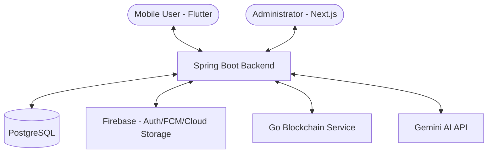

# AURA: Integrated AI Safety, Wellness, and Social Social Platform
## Technical System Overview & Documentation

**AURA** (AI-powered Universal Relief and Assistance) is a multi-dimensional platform designed to provide a cohesive ecosystem for personal safety, community wellness, and real-time social engagement. It integrates mobile applications, a robust backend, an administrative dashboard, and a custom blockchain layer to ensure data integrity and real-time response.

---

## 1. Project Overview

### What is AURA?
AURA is an enterprise-grade solution that bridges the gap between digital safety and community-driven wellness. It provides users with tools for emergency response (SOS), wellness tracking, real-time messaging, and secure activity monitoring.

### The Problem It Solves
- **Fragmented Emergency Response**: Most safety apps lack integrated community and professional monitoring.
- **Wellness Isolation**: Wellness tracking often lacks a social component for motivation and support.
- **Data Integrity**: Critical events like SOS triggers often lack immutable logs for auditing and verification.
- **Language Barriers**: Collaborative platforms often struggle with multilingual community interactions.

### Key Platform Goals
- **Real-time Safety**: Instant SOS triggers with live location streaming.
- **Community Wellness**: A social feed for sharing wellness updates and activities.
- **Immutable Logging**: Leveraging blockchain for critical event data.
- **AI-Driven Engagement**: Using LLMs for language translation and content moderation.

### Target Users
- Individuals seeking personal safety tools.
- Wellness enthusiasts and communities.
- Administrators and organizations managing safety and activities.

---

## 2. System Architecture

AURA follows a micro-service inspired modular monolithic architecture for its backend, with dedicated services for blockchain and administration.

### High-Level Architecture


### Data Flow
1.  **Mobile App → Backend**: Via REST APIs for data and WebSockets (STOMP) for real-time messaging and live location.
2.  **Backend → Blockchain**: Critical SOS event data is hashed and stored in the Go-based blockchain service.
3.  **Backend → AI**: Textual content sent for language detection and translation.
4.  **Admin Dashboard → Backend**: Management operations via secure REST APIs.
5.  **Notifications**: Backend triggers FCM for push notifications to mobile devices.

---

## 3. Technology Stack

### Frontend (Mobile App)
- **Framework**: Flutter (Dart)
- **State Management**: Riverpod
- **Local Storage**: Hive, Shared Preferences
- **Networking**: Dio
- **Real-time**: stomp_dart_client, web_socket_channel
- **Native Integration**: Kotlin (Android Platform Channels for Alarms & SMS)
- **Services**: Firebase (Auth, Analytics, Crashlytics, Messaging)

### Backend System
- **Framework**: Spring Boot 3.5.7 (Java 21)
- **Persistence**: Spring Data JPA with PostgreSQL
- **Security**: Spring Security, JJWT (JWT), Firebase Admin SDK
- **Real-time**: Spring WebSocket with STOMP
- **Connectivity**: RestTemplate, Jackson
- **Utilities**: Lombok, Validation, Mail

### Admin Panel
- **Framework**: Next.js (App Router), TypeScript
- **Styling**: Tailwind CSS
- **Networking**: Axios / Fetch API

### Blockchain Layer
- **Language**: Go
- **Hashing**: SHA-256
- **Persistence**: File-based block storage
- **Communication**: RESTful API for block creation and validation

### AI & External Services
- **Gemini AI**: (gemini-2.5-flash) for translation and language detection.
- **FCM**: Firebase Cloud Messaging for push updates.
- **Map Services**: flutter_map with OpenStreetMap integration.

---

## 4. Mobile Application (Flutter)

The AURA mobile application is built using a feature-based architecture, ensuring high modularity and maintainability.

### Application Structure
- **Core (`lib/core/`)**: Contains shared configurations, API clients (Dio), constants, routing (GoRouter-like setup), and base UI components.
- **Features (`lib/features/`)**: Each module contains its own data, providers, and UI screens.
- **Providers (`lib/features/.../providers`)**: State management via Riverpod.
- **Models (`lib/features/.../models`)**: Data structures and serialization.

### Primary Features & Screens

#### Authentication
- **Description**: Secure entry point for the application.
- **Functionality**: Email/Password login, Phone number authentication, Google Sign-In, and comprehensive Onboarding.
- **Key Components**: `LoginScreen`, `SignupScreen`, `OnboardingScreen`.

#### SOS System
- **Description**: Critical emergency response module.
- **Functionality**: Pulse-trigger SOS, emergency contact alerts, live location streaming to trusted contacts, and recording SOS events on the blockchain via the backend.
- **Key Components**: `SOSActionButton`, `LiveLocationMap`.

#### Wellness Feed
- **Description**: Community social space for wellness.
- **Functionality**: Post wellness updates (text/images), community feed, likes/comments, and AI-driven translation for multilingual support.
- **Key Components**: `WellnessFeedScreen`, `WellnessPostCard`.

#### Walking Tracker
- **Description**: Physical activity monitoring.
- **Functionality**: GPS-based tracking for walks, distance calculation, time monitoring, and session history.
- **Key Components**: `WalkingTrackerScreen`, `WalkingSessionLog`.

#### Messaging
- **Description**: Real-time communication.
- **Functionality**: Private and group messaging using STOMP protocols, real-time message indicators, and chat history.
- **Key Components**: `ChatListScreen`, `MessageBubble`.

#### Alarm System
- **Description**: Integrated health and activity reminders.
- **Functionality**: Personalized alarms for medications, workouts, or wellness checks.
- **Implementation**: Utilizes a native Kotlin `AlarmScheduler` for precise OS-level scheduling even when the app is in the background.

#### SMS Integration
- **Description**: Automated emergency notification.
- **Functionality**: Sends SMS alerts to trusted contacts during SOS events.
- **Implementation**: Leveraging Kotlin `SmsManager` via Flutter Platform Channels.

---

## 5. Backend System (Spring Boot)

The backend is a robust Spring Boot application managing complex business logic and orchestrating between different services.

### Architecture
- **Controller Layer**: REST endpoints processing incoming requests.
- **Service Layer**: Core business logic and multi-module orchestration.
- **Repository Layer**: JPA abstractions for PostgreSQL interaction.
- **Security**: JWT-based stateless authentication with Spring Security integration.

### Core Backend Modules

#### User Module (`com.backend.aura.modules.user`)
- **Purpose**: Identity and Access Management.
- **Core APIs**: Profile management, identity verification, account settings.
- **Key Entity**: `User`.

#### SOS Module (`com.backend.aura.modules.sos`)
- **Purpose**: Emergency orchestration.
- **Business Logic**: Triggers notifications, logs location history, and calls the Blockchain service for immutable hashing.
- **Key Entity**: `SOSEvent`.

#### Wellness Module (`com.backend.aura.modules.wellness`)
- **Purpose**: Community content management.
- **Business Logic**: Moderation of posts, management of social interactions, and integration with the Translation module.
- **Key Entity**: `WellnessUpdate`.

#### Messaging Module (`com.backend.aura.modules.messaging`)
- **Purpose**: Real-time chat infrastructure.
- **Protocol**: STOMP over WebSockets.
- **Key Entities**: `Message`, `Conversation`.

---

## 6. Database Design

AURA uses a relational schema designed for scalability and performance.

### Key Entities & Relationships

| Entity | Primary Keys | Relationships | Important Fields |
| :--- | :--- | :--- | :--- |
| **User** | `uid` (String) | Auth identity, Post author | `phone`, `email`, `fcmToken`, `accountStatus` |
| **SOSEvent** | `id` (UUID) | Linked to `User` | `latitude`, `longitude`, `blockHash`, `status` |
| **WellnessUpdate** | `id` (UUID) | Written by `User` | `content`, `category`, `likesCount`, `isApproved` |
| **Message** | `id` (Long) | Part of `Conversation` | `senderId`, `content`, `timestamp`, `isRead` |
| **WalkingSession** | `id` (Long) | Performed by `User` | `distance`, `duration`, `startTime`, `pathData` |

### Data Flow Integration
- **Relational Integrity**: Foreign keys ensure links between users, their activities, and SOS events.
- **Status Auditing**: Timestamps (`createdAt`, `updatedAt`) are maintained across all primary entities.
- **Blockchain Off-loading**: Critical IDs/Hashes from the blockchain are stored back in `SOSEvent` for verification.

---

## 7. Blockchain System (Go)

AURA implements a custom blockchain layer in Go to provide an immutable audit trail for critical safety events like SOS triggers.

### Block Structure
- **Index**: Sequence number of the block.
- **Timestamp**: Time of block creation.
- **Data**: JSON-stringified event details (e.g., SOS user ID, location, message).
- **PreviousHash**: SHA-256 hash of the preceding block.
- **Hash**: SHA-256 hash of the current block components (Index + Timestamp + Data + PreviousHash).

### System Characteristics
- **Hashing**: Consistent SHA-256 for data integrity.
- **Chain Validation**: Built-in verification loop ensures no block in the history has been tampered with.
- **Persistence**: Blocks are saved to disk in JSON format for recovery and long-term storage.
- **Integration**: The Spring Boot backend acts as the orchestrator, calling the Go service's REST API whenever a new SOS event needs to be finalized and "blocked."

---

## 8. Admin Dashboard (Next.js)

The Admin Dashboard provides a powerful command center for platform moderators and system administrators.

### Core Features
- **User Management**: View user profiles, account status, and activity history.
- **Content Moderation**: Review and approve `WellnessUpdates` before they become visible to the wide community.
- **SOS Monitoring**: Live tracking of active SOS events, displaying locations on an interactive map.
- **Notification Broadcasting**: Send platform-wide announcements or targeted push notifications via the backend/FCM.
- **Activity Configuration**: Manage gym exercises, activity categories, and global settings.

### Technology & Integration
- **Framework**: Next.js with App Router for modern, server-side optimized performance.
- **Security**: Secure login flow with admin-specific role checks.
- **API**: Communicates with the Spring Boot backend via a dedicated set of administrative REST endpoints.

---

## 9. Real-Time Systems

AURA is designed for high-interactivity and immediate response through its real-time architecture.

### Messaging System
- **Protocol**: STOMP over WebSockets.
- **Infrastructure**: Spring Message Broker handles message routing between clients.
- **Features**: Direct messaging, multi-user conversations, and typing indicators.

### Live Location Streaming
- **Workflow**: When an SOS is active, the mobile app streams location coordinates to the backend via WebSocket.
- **Distribution**: The backend forwards these updates to subscribed trusted contacts and the Admin Dashboard in real-time.

### Event Architecture
- **Trigger**: SOS Pulse / Message Send.
- **Transmission**: WebSocket (`/ws` endpoint).
- **Persistence**: Parallel saving to PostgreSQL while broadcasting to listeners.

---

## 10. AI Integration

AURA leverages state-of-the-art Generative AI to enhance user engagement and provide intelligent assistance.

### Language Services
- **Gemini AI**: The platform uses `gemini-2.5-flash` for high-speed, accurate language processing.
- **Translation Workflow**: 
    1.  User posts content (e.g., Wellness Update).
    2.  Backend triggers Gemini to detect the language.
    3.  If not English, Gemini translates the text while maintaining context.
    4.  Translation result is stored alongside the original content for instant retrieval.
- **Safety Filtering**: AI checks for prohibited content during the translation/moderation phase.

---

## 11. Notification System

A cohesive notification strategy ensures that users remain informed and safe.

### Firebase Cloud Messaging (FCM)
- **Architecture**: A central `NotificationService` in the backend manages FCM token registration and message dispatching.
- **Delivery**: Backend sends payloads to FCM servers, which push to registered mobile devices.

### Notification Types
- **SOS Alerts**: Highest priority; triggered for trusted contacts when an SOS is activated.
- **Messaging**: Alerts for new incoming chat messages.
- **Wellness Activity**: Notifications for likes, comments, or approved posts.
- **Reminders**: Personalized health or activity alerts.

---

## 12. Security Architecture

Security is built into every layer of AURA to protect user data and ensure system integrity.

### Authentication
- **Mobile**: Firebase Auth (OAuth2, Phone, Email/Password).
- **Backend API**: Stateless JWT-based authentication. Every request (except public routes) must include a valid bearer token.

### Authorization
- **Role-Based Access**: Specialized endpoints for `ADMIN` roles in the dashboard.
- **Data Ownership**: Users can only access/modify their own profiles and SOS history through secure ownership checks in the service layer.

### Integrity
- **Blockchain Verification**: SHA-256 hashing prevents silent tampering with emergency logs.
- **Environment Management**: Secure handling of API keys (Gemini, Firebase) via backend properties and environment variables.

---

## 13. File Structure

### Mobile Application (`aura_app/`)
```text
lib/
├── core/               # Shared logic, theme, network, utils
├── features/           # Feature-based modules
│   ├── auth/           # Login, Signup, Onboarding
│   ├── sos/            # SOS actions, Live location
│   ├── wellness/       # Post creation, community feed
│   ├── walking/        # GPS tracking, walking sessions
│   └── messaging/      # Chat UI and WebSocket logic
└── main.dart           # Application entry point

**Android Platform Layer (`aura_app/android/app/src/main/kotlin/com/example/aura_app/`)**
```text
.
├── MainActivity.kt     # Platform channel bridge (Alarms, SMS)
└── alarm/              # Kotlin Alarm services
    ├── AlarmScheduler  # OS-level scheduling
    ├── AlarmService    # Background execution
    └── AlarmReceiver   # Broadcast handling
```
```

### Backend System (`aura_backend/`)
```text
src/main/java/com/backend/aura/
├── config/             # Security, Firebase, CORS, Web configs
├── core/               # Low-level logging and core utilities
└── modules/            # Domain-driven modules
    ├── user/           # User entities, services, controllers
    ├── sos/            # SOS logic and Blockchain client
    ├── wellness/       # Social feed and AI translation trigger
    └── messaging/      # WebSocket/STOMP configurations
```

### Blockchain Service (`aura_chain/`)
```text
cmd/main.go             # Service entry point
internal/
├── block/              # Block data structure
├── blockchain/         # Chain logic and validation
├── server/             # REST API for external interaction
└── storage/            # Disk persistence logic
```

### Admin Dashboard (`aura_admin/`)
```text
app/
├── admin/              # Admin-specific routes
│   ├── users/          # User management screens
│   ├── sos-events/     # SOS monitoring dashboard
│   └── wellness/       # Content moderation tools
├── components/         # Shared UI components
└── core/               # Networking and constants

---

## 14. Key Features Summary

| Feature | Platform(s) | Impact | Description |
| :--- | :--- | :--- | :--- |
| **Pulse SOS** | Mobile, Backend, Chain | Safety | Immediate emergency trigger with immutable logging. |
| **Live Tracking** | Mobile, Backend, Admin | Response | Real-time GPS streaming during emergencies. |
| **Wellness Feed** | Mobile, Backend, Admin | Social | Community wellness updates with AI moderation. |
| **AI Translation** | Mobile, Backend | Inclusivity | Automatic translation of wellness posts to English. |
| **Step/Walk Tracking**| Mobile | Health | Monitors physical activity and walking sessions. |
| **Secure Messaging** | Mobile, Backend | Social | Real-time chat powered by STOMP WebSockets. |
| **Admin Panel** | Admin Dashboard | Governance | Centralized management of users and content. |

---

## 15. System Workflows

### User Registration & Onboarding
1.  **Mobile App**: User signs up via Firebase (Phone/Email).
2.  **Backend**: Receives `uid` and creates a corresponding `User` entity.
3.  **Mobile App**: User completes profile details (name, dob, bio).

### SOS Trigger & Finalization
1.  **Mobile App**: User triggers SOS.
2.  **Backend**: Dispatches FCM alerts to trusted contacts and admins.
3.  **Backend**: Opens WebSocket channel for live location updates.
4.  **Backend → Blockchain**: At event closure, hashes metadata and sends to Go service.
5.  **Chain Service**: Mines a new block and returns the hash to the backend.

### Wellness Post & AI Moderation
1.  **Mobile App**: User submits a wellness post with text and optional image.
2.  **Backend**: Sends text to Gemini AI for language detection and translation.
3.  **Backend**: Stores original and translated text.
4.  **Admin Dashboard**: Moderator reviews the post and marks as `isApproved`.
5.  **Mobile App**: Post appears in the community-wide wellness feed.

---

**End of AURA System Documentation.**

```


