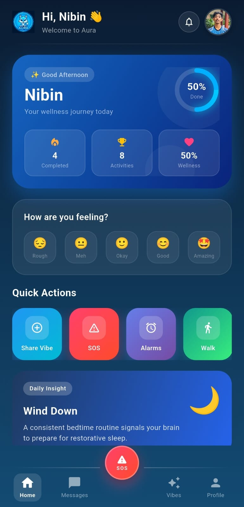
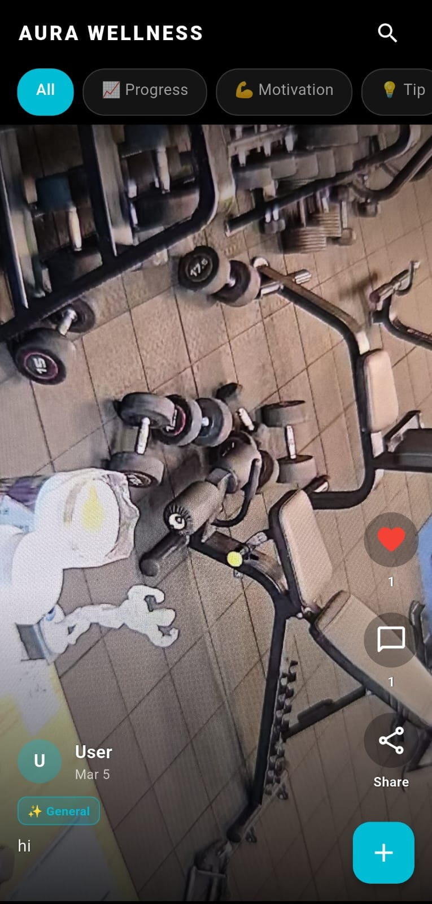
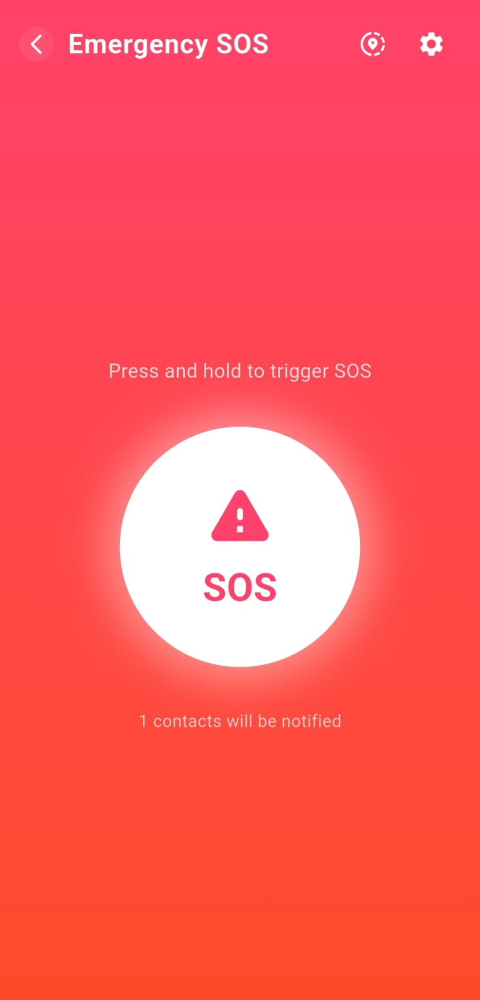
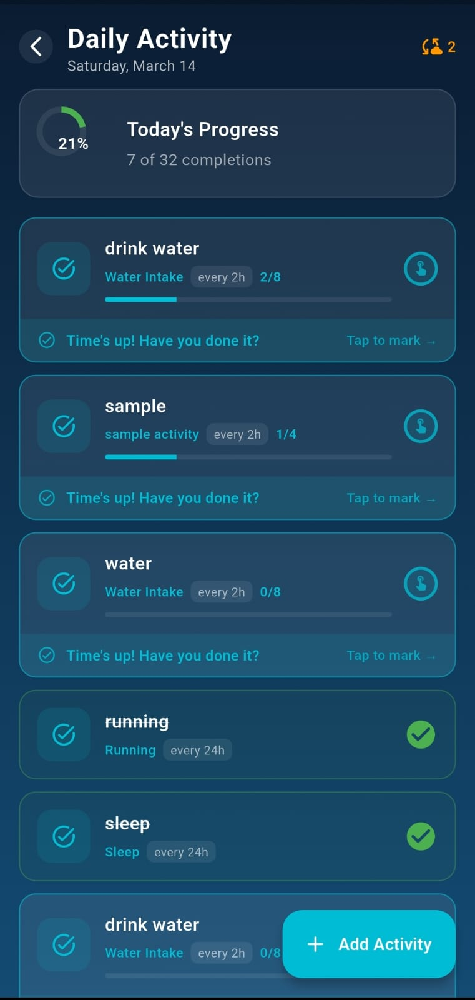
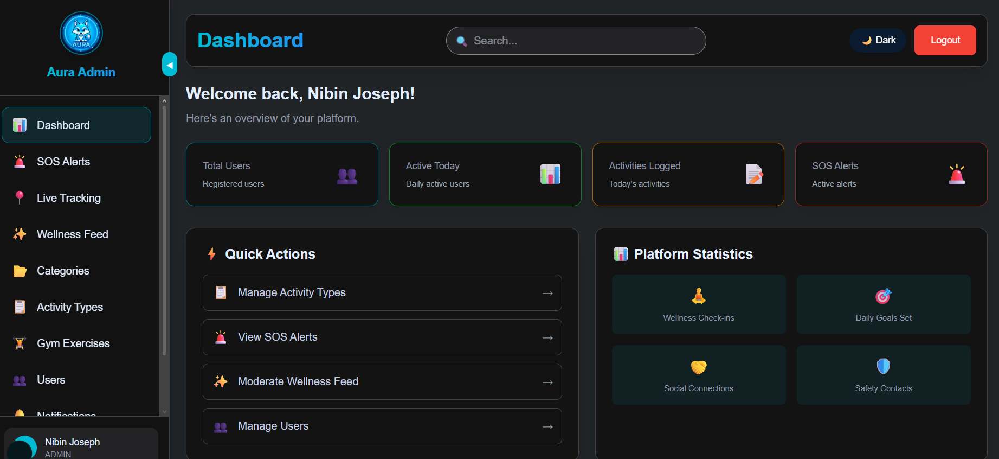

# AURA: Integrated AI Safety, Wellness & Community Platform

**AURA** (AI-powered Universal Relief and Assistance) is an enterprise-grade ecosystem that bridges the gap between digital safety and community wellness. By intertwining **real-time emergency response**, **social wellness engagement**, and **immutable blockchain logging**, AURA provides a holistic solution for modern personal and community security.

---

## 📸 Visual Showcase

### Mobile Application
| Home | Wellness Feed | SOS System | Activity Tracking |
| :---: | :---: | :---: | :---: |
|  |  |  |  |

### Admin Dashboard

---

## 🔥 Key Platform Features

### 🚨 Safety & Emergency Response (Pulse SOS)
- **Instant SOS Activation**: Pulse-trigger mechanism for immediate emergency alerts.
- **Live Location Streaming**: Real-time GPS broadcasting to trusted contacts and the Admin dashboard.
- **Smart Notification Pipeline**: Multi-channel alerts (Push, SMS, Mail) triggered automatically during SOS events.
- **Blockchain Audit Trail**: Every SOS event is hashed and logged on an immutable ledger for verified auditing.

### 🌱 Community Wellness & Social Engagement
- **Interactive Wellness Feed**: Share updates, photos, and milestones within a supportive community.
- **AI-Driven Translation**: Break language barriers with automatic detection and translation (Gemini AI) of multilingual posts.
- **Dynamic Content Moderation**: Intelligent filtering and professional moderation tools to maintain a healthy community environment.
- **Engagement Analytics**: Social metrics including likes, comments, and community trending topics.

### 🏃 Activity & Health Monitoring
- **GPS Walking Tracker**: Precise tracking of walking sessions with distance, duration, and path visualization.
- **Personalized Goal Setting**: Set and monitor daily wellness targets.
- **Integrated Reminder System**: Smart alarms for medications, hydration, and scheduled activities.
- **Activity History**: Comprehensive logs of your physical progress over time.

### 🛡️ Secure & Scalable Infrastructure
- **Stateless Authentication**: High-security JWT-based auth with multi-platform (Google/Phone/Email) support.
- **Real-time Engine**: STOMP over WebSockets for zero-latency messaging and state updates.
- **Centralized Admin Dashboard**: Full control over user management, SOS monitoring, and platform configuration.

---

## 🏗️ System Architecture

AURA is built on a modular, high-performance architecture:
- **Mobile Client**: Feature-rich Flutter app with Riverpod state management and native Kotlin integration for Android-specific services.
- **Service Core**: Robust Spring Boot 3 backend orchestrating complex workflows.
- **Integrity Layer**: Custom Go-based blockchain for high-integrity logging.
- **Management Portal**: Next.js Admin Panel for real-time monitoring and governance.

---

## 🚀 Getting Started

For deep technical insights, setup guides, and API documentation:

👉 **[READ THE FULL SYSTEM OVERVIEW](./AURA_SYSTEM_OVERVIEW.md)**

### Installation Quick Links:
- **Backend Setup**: [Spring Boot Configuration](./AURA_SYSTEM_OVERVIEW.md#5-backend-system-spring-boot)
- **Mobile Setup**: [Flutter Development Guide](./AURA_SYSTEM_OVERVIEW.md#4-mobile-application-flutter)
- **Blockchain Setup**: [Go Service Deployment](./AURA_SYSTEM_OVERVIEW.md#7-blockchain-system-go)
- **Admin Dashboard**: [Next.js Portal Requirements](./AURA_SYSTEM_OVERVIEW.md#8-admin-dashboard-nextjs)

---

## 🛡️ Professional Documentation
- [Architecture Deep-Dive](./AURA_SYSTEM_OVERVIEW.md#2-system-architecture)
- [Database Schema](./AURA_SYSTEM_OVERVIEW.md#6-database-design)
- [Real-Time Systems](./AURA_SYSTEM_OVERVIEW.md#9-real-time-systems)
- [AI & Gemini Workflows](./AURA_SYSTEM_OVERVIEW.md#10-ai-integration)

---

---

**© 2026 AURA Team. All rights reserved.**

---

*Found a bug? Have a suggestion? Feel free to reach out to the project maintainers.*
